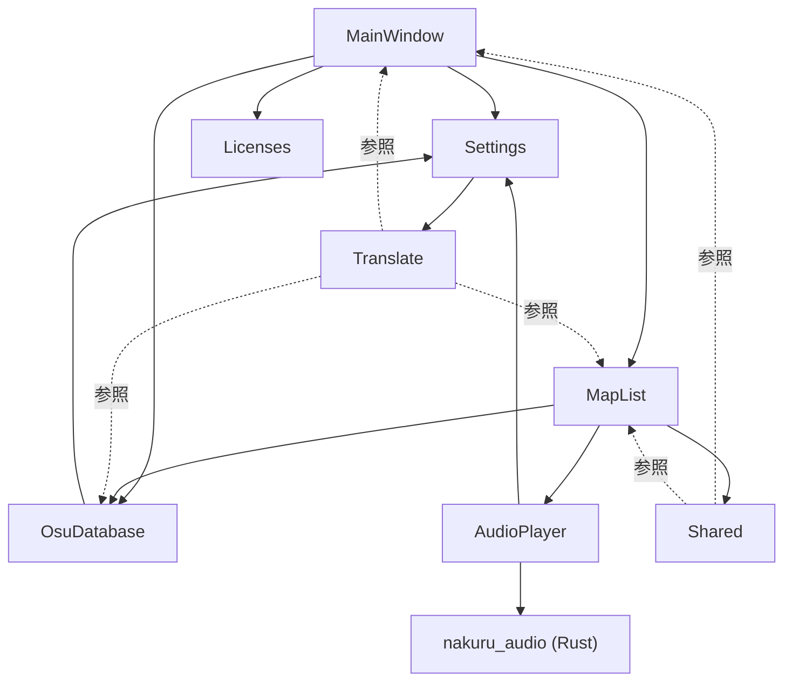

# NakuruTool アーキテクチャ概要

> **対象読者**: 新規参画者・LLMエージェント  
> **目的**: プロジェクト全体像の迅速な把握

---

## 1. プロジェクト概要

osu! の beatmap コレクション編集ツール。各種データベースファイルを読み込み、譜面をフィルタリングし、カスタムコレクションを生成する Avalonia デスクトップアプリケーション。

### 主要機能

- **DB読み込み**: `osu!.db`、`collection.db`、`scores.db` の3種を並列パース
- **譜面一覧表示**: ページング付きリスト表示、スコアデータの統合表示
- **高度なフィルタリング**: 最大8条件の複合フィルタ、プリセット保存/復元
- **コレクション生成**: フィルタ結果から `collection.db` を生成・書き込み
- **オーディオプレビュー**: 譜面選択時に音声を自動再生（Rust ネイティブライブラリ）
- **多言語対応**: 日本語/英語の動的切り替え
- **テーマ切替**: ダーク/ライトテーマ

---

## 2. 技術スタック

### NuGet パッケージ

| パッケージ | バージョン | 用途 |
|-----------|-----------|------|
| Avalonia | 11.3.10 | UIフレームワーク |
| Avalonia.Desktop | 11.3.10 | デスクトップランタイム |
| Avalonia.Fonts.Inter | 11.3.10 | Inter フォント |
| Avalonia.Diagnostics | 11.3.10 | デバッグ用DevTools（Debug構成のみ） |
| CommunityToolkit.Mvvm | 8.4.0 | MVVM Source Generator（`[ObservableProperty]`、`[RelayCommand]`） |
| HotAvalonia | 3.0.2 | XAML ホットリロード |
| Material.Icons.Avalonia | 2.4.1 | Material Design アイコン |
| Pure.DI | 2.2.15 | コンパイル時DI（Source Generator） |
| R3 | 1.3.0 | リアクティブプログラミング |
| R3Extensions.Avalonia | 1.3.0 | R3 の Avalonia バインディング |
| Semi.Avalonia | 11.3.7.1 | Semi Design テーマ |
| Semi.Avalonia.DataGrid | 11.3.7.1 | DataGrid テーマ |
| ZLinq | 1.5.4 | ゼロアロケーション LINQ |

### ネイティブライブラリ

| ライブラリ | 言語 | 用途 |
|-----------|------|------|
| nakuru_audio | Rust | オーディオ再生エンジン（P/Invoke経由） |

---

## 3. ディレクトリ構造

### ソリューション構成

`NakuruTool_Avalonia_AOT.slnx` に以下2プロジェクトを含む:

- **NakuruTool_Avalonia_AOT** — メインアプリケーション
- **NakuruTool_Avalonia_AOT.Tests** — スクリーンショットテスト

### Features/ 配下のモジュール構成

```
Features/
├── AudioPlayer/       # オーディオ再生（Rust FFI連携）
├── Licenses/          # ライセンス表示画面
├── MainWindow/        # メインウィンドウ（タブナビゲーション、読み込みオーバーレイ）
├── MapList/           # 譜面一覧・フィルタ・コレクション生成
│   └── Models/        #   FilterCondition, FilterPreset
├── OsuDatabase/       # osu! DB パーサー群・データモデル
├── Settings/          # 設定画面・設定永続化
├── Shared/            # 共通基盤
│   ├── Converters/    #   値コンバーター（13種）
│   ├── Extensions/    #   R3Extensions
│   └── ViewModels/    #   ViewModelBase
└── Translate/         # 多言語対応（LanguageService, TranslateExtension）
    └── Resources/     #   言語JSON
```

### その他のディレクトリ

```
native/
└── nakuru_audio/      # Rust オーディオライブラリ
    └── src/lib.rs

docs/                  # ドキュメント群
requirement/           # 要件定義
```

---

## 4. アーキテクチャパターン

### 4.1 MVVM

#### View / ViewModel 対応表

| View | ViewModel |
|------|-----------|
| `MainWindowView` | `MainWindowViewModel` |
| `DatabaseLoadingView` | `DatabaseLoadingViewModel` |
| `MapListPageView` | `MapListPageViewModel` |
| `MapListView` | `MapListViewModel` |
| `MapFilterView` | `MapFilterViewModel` |
| `SettingsPage` | `SettingsViewModel` |
| `LicensesPage` | `LicensesViewModel` |

#### ViewModelBase の責務

- `ObservableObject`（CommunityToolkit.Mvvm）を継承
- `CompositeDisposable` を保持し、R3 購読のライフサイクルを管理
- `Dispose()` で全購読を一括解放
- `LanguageService.Instance` への参照を提供（`LangServiceInstance`）

#### コンパイル済みバインディング

- csproj で `AvaloniaUseCompiledBindingsByDefault` = `true` を設定
- 各 View の XAML に `x:DataType` を指定して型安全なバインディングを実現
- NativeAOT 環境でのリフレクションベースバインディングを排除

### 4.2 DI 構成（Pure.DI）

#### Composition.cs の登録一覧

**ViewModel（全て Singleton）**

- `MainWindowViewModel`
- `ISettingsViewModel` → `SettingsViewModel`
- `IDatabaseLoadingViewModel` → `DatabaseLoadingViewModel`
- `IMapListViewModel` → `MapListViewModel`
- `MapListPageViewModel`
- `AudioPlayerViewModel`
- `ILicensesViewModel` → `LicensesViewModel`

**Service（全て Singleton）**

- `ISettingsService` → `SettingsService`
- `IDatabaseService` → `DatabaseService`
- `IGenerateCollectionService` → `GenerateCollectionService`
- `IFilterPresetService` → `FilterPresetService`
- `IAudioPlayerService` → `AudioPlayerService`

**Root（エントリポイント）**

- `MainWindowView` — `.Root<MainWindowView>("MainWindow")` として登録

#### 初期化フロー

```
Program.Main()
  → AppBuilder.Configure<App>()
    → App.Initialize()
      → AvaloniaXamlLoader.Load() / SemiTheme ロケール設定
    → App.OnFrameworkInitializationCompleted()
      → new Composition()
      → desktop.MainWindow = composition.MainWindow
        → MainWindowView + 全依存 ViewModel/Service がコンストラクタ注入で解決
```

### 4.3 リアクティブプログラミング（R3）

#### 主な使用パターン

| パターン | 概要 |
|---------|------|
| `Subject<T>` | イベントの手動発行（進捗通知など） |
| `ObserveProperty()` | 特定プロパティの変更を監視 |
| `ObservePropertyChanged()` | 全プロパティの変更を監視 |
| `Subscribe().AddTo(Disposables)` | 購読をライフサイクルに紐付け |
| `Throttle()` / `Debounce()` | 高頻度イベントの間引き |
| `Observable.FromEvent()` | .NET イベントを Observable に変換 |

#### R3Extensions カスタムメソッド一覧

| メソッド | 引数 | 用途 |
|---------|------|------|
| `ObserveProperty<T>()` | `source: T`, `propertyName: string` | 特定プロパティの `PropertyChanged` を `Observable` に変換 |
| `ObservePropertyChanged<T>()` | `source: T` | 全プロパティの `PropertyChanged` を `Observable` に変換 |
| `ObservePropertyAndSubscribe<T>()` | `source: T`, `propertyName: string`, `action: Action`, `disposables: CompositeDisposable` | プロパティ変更の監視＋購読＋ライフサイクル管理を一括実行 |
| `ObserveCollectionChanged<T>()` | `source: AvaloniaList<T>` | `AvaloniaList` の `CollectionChanged` を `Observable` に変換 |
| `ObserveElementPropertyChanged<T>()` | `source: AvaloniaList<T>` | `AvaloniaList` 内の各要素の `PropertyChanged` を監視（要素の追加・削除に自動追従） |

---

## 5. モジュール依存関係図



---

## 6. UI テーマ・スタイリング

| 項目 | 設定 |
|------|------|
| テーマ | Semi.Avalonia（`SemiTheme`） |
| DataGrid テーマ | Semi.Avalonia.DataGrid（`DataGridSemiTheme`） |
| アイコン | Material.Icons.Avalonia（`MaterialIconStyles`） |
| フォントファミリー | `Meiryo, Yu Gothic UI, Hiragino Sans, Noto Sans CJK JP, sans-serif` |
| デフォルトロケール | `ja-JP` |
| テーマバリアント | `Default`（システム追従）、`Dark` / `Light` 切替可能 |

---

## 関連ドキュメント

| ドキュメント | 内容 |
|-------------|------|
| [MODULES.md](MODULES.md) | Feature モジュールの詳細仕様 |
| [DATA_FLOW.md](DATA_FLOW.md) | データフローと状態管理 |
| [NATIVE_AOT.md](NATIVE_AOT.md) | NativeAOT 対応ガイドライン |
| [TESTING.md](TESTING.md) | テスト戦略・実行方法 |
| [BUILD.md](BUILD.md) | ビルド・環境構築ガイド |
