# データフローと状態管理

> NakuruToolにおけるデータの流れ、R3リアクティブチェーン、状態管理の全体像を解説する。

関連ドキュメント: [ARCHITECTURE.md](ARCHITECTURE.md) | [MODULES.md](MODULES.md) | [BUILD.md](BUILD.md)

---

## 1. アプリケーション起動フロー

アプリケーションは `Program.Main` からAvaloniaのライフサイクルに沿って起動し、Pure.DIの `Composition` クラスで全サービス・ViewModelを解決する。

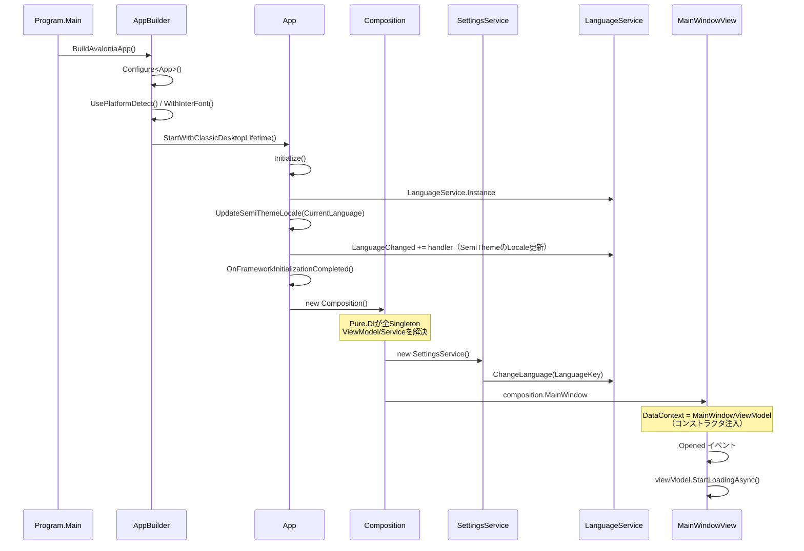
```mermaid
sequenceDiagram
    participant P as Program.Main
    participant AB as AppBuilder
    participant App as App
    participant C as Composition
    participant SS as SettingsService
    participant LS as LanguageService
    participant MW as MainWindowView

    P->>AB: BuildAvaloniaApp()
    AB->>AB: Configure<App>()
    AB->>AB: UsePlatformDetect() / WithInterFont()
    AB->>App: StartWithClassicDesktopLifetime()
    App->>App: Initialize()
    App->>LS: LanguageService.Instance
    App->>App: UpdateSemiThemeLocale(CurrentLanguage)
    App->>LS: LanguageChanged += handler（SemiThemeのLocale更新）
    App->>App: OnFrameworkInitializationCompleted()
    App->>C: new Composition()
    Note over C: Pure.DIが全Singleton<br/>ViewModel/Serviceを解決
    C->>SS: new SettingsService()
    SS->>LS: ChangeLanguage(LanguageKey)
    C->>MW: composition.MainWindow
    Note over MW: DataContext = MainWindowViewModel<br/>（コンストラクタ注入）
    MW->>MW: Opened イベント
    MW->>MW: viewModel.StartLoadingAsync()
```

### 起動時の初期化順序

1. `Program.Main` → `AppBuilder.Configure<App>()` でAvaloniaアプリを構成
2. `App.Initialize()` で言語サービス初期化・SemiTheme Locale設定・言語変更イベント購読
3. `App.OnFrameworkInitializationCompleted()` で `Composition` をインスタンス化
4. Pure.DIが依存グラフを解決し `MainWindowView` を生成（DataContextに `MainWindowViewModel` を注入）
5. ウィンドウの `Opened` イベントで `StartLoadingAsync()` を呼び出し、DB読み込みを開始

---

## 2. DB読み込みフロー

`MainWindowViewModel.StartLoadingAsync()` を起点に、3つのDBファイルを並列読み込みし、スコアデータをBeatmapに統合する。

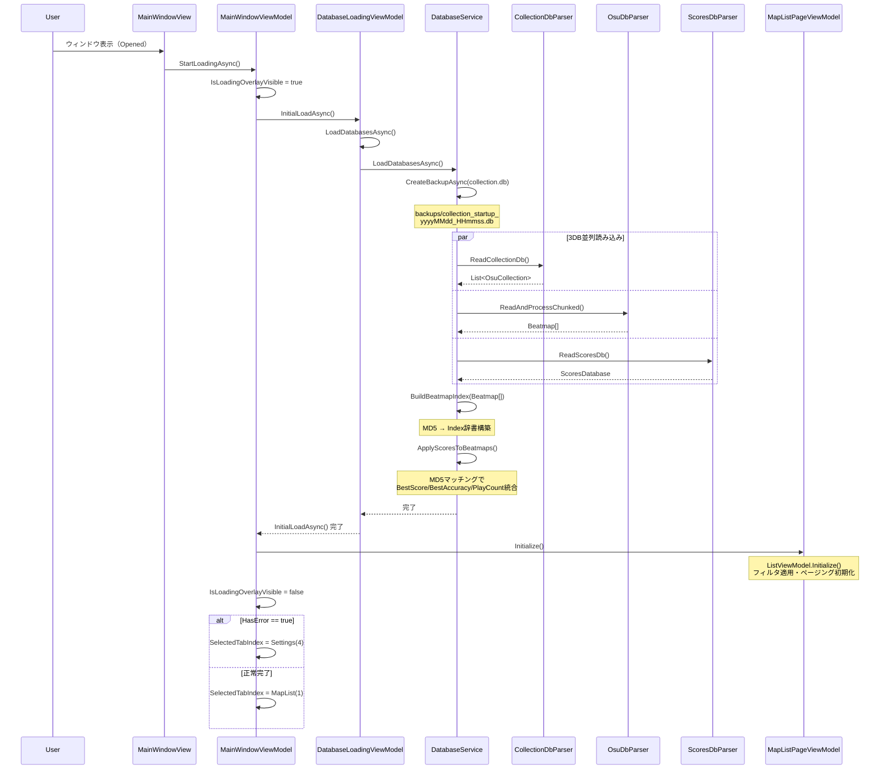
```mermaid
sequenceDiagram
    participant User
    participant MWV as MainWindowView
    participant MW as MainWindowViewModel
    participant DL as DatabaseLoadingViewModel
    participant DS as DatabaseService
    participant CP as CollectionDbParser
    participant OP as OsuDbParser
    participant SP as ScoresDbParser
    participant ML as MapListPageViewModel

    User->>MWV: ウィンドウ表示（Opened）
    MWV->>MW: StartLoadingAsync()
    MW->>MW: IsLoadingOverlayVisible = true
    MW->>DL: InitialLoadAsync()
    DL->>DL: LoadDatabasesAsync()
    DL->>DS: LoadDatabasesAsync()

    DS->>DS: CreateBackupAsync(collection.db)
    Note over DS: backups/collection_startup_<br/>yyyyMMdd_HHmmss.db

    par 3DB並列読み込み
        DS->>CP: ReadCollectionDb()
        CP-->>DS: List<OsuCollection>
    and
        DS->>OP: ReadAndProcessChunked()
        OP-->>DS: Beatmap[]
    and
        DS->>SP: ReadScoresDb()
        SP-->>DS: ScoresDatabase
    end

    DS->>DS: BuildBeatmapIndex(Beatmap[])
    Note over DS: MD5 → Index辞書構築

    DS->>DS: ApplyScoresToBeatmaps()
    Note over DS: MD5マッチングで<br/>BestScore/BestAccuracy/PlayCount統合

    DS-->>DL: 完了
    DL-->>MW: InitialLoadAsync() 完了

    MW->>ML: Initialize()
    Note over ML: ListViewModel.Initialize()<br/>フィルタ適用・ページング初期化
    MW->>MW: IsLoadingOverlayVisible = false

    alt HasError == true
        MW->>MW: SelectedTabIndex = Settings(4)
    else 正常完了
        MW->>MW: SelectedTabIndex = MapList(1)
    end
```

### 読み込み詳細

#### バックアップ作成
- `collection.db` のバックアップを `backups/collection_startup_{timestamp}.db` に作成
- アプリ起動時に1回のみ実行

#### 3DB並列読み込み
`Task.WhenAll` で以下の3パーサーを並列実行：

| DBファイル | パーサー | 出力 |
|-----------|---------|------|
| collection.db | `CollectionDbParser` | `List<OsuCollection>` |
| osu!.db | `OsuDbParser` | `Beatmap[]` |
| scores.db | `ScoresDbParser` | `ScoresDatabase` |

#### スコアデータ統合
1. `Beatmap[]` からMD5ハッシュ → インデックスの辞書を構築
2. `ScoresDatabase` の各エントリのMD5ハッシュで辞書を検索
3. マッチしたBeatmapに `BestScore` / `BestAccuracy` / `PlayCount` を統合（recordの `with` 式で更新）

#### 進捗通知（3系統）
`DatabaseService` は3つの `Subject<DatabaseLoadProgress>` を持ち、各パーサーの進捗を `Dispatcher.UIThread.Post` 経由でUIスレッドに通知する。

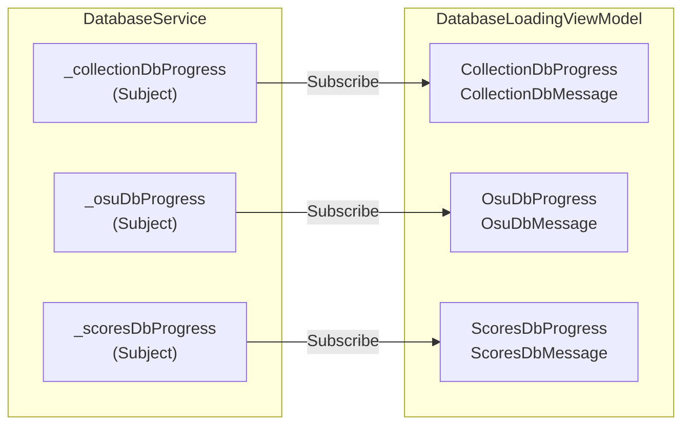
```mermaid
flowchart LR
    subgraph DatabaseService
        S1["_collectionDbProgress<br/>(Subject)"]
        S2["_osuDbProgress<br/>(Subject)"]
        S3["_scoresDbProgress<br/>(Subject)"]
    end

    subgraph DatabaseLoadingViewModel
        P1["CollectionDbProgress<br/>CollectionDbMessage"]
        P2["OsuDbProgress<br/>OsuDbMessage"]
        P3["ScoresDbProgress<br/>ScoresDbMessage"]
    end

    S1 -->|Subscribe| P1
    S2 -->|Subscribe| P2
    S3 -->|Subscribe| P3
```

---

## 3. フィルタリングフロー

ユーザーがフィルタ条件を操作すると、R3リアクティブチェーンを通じて譜面一覧が自動更新される。

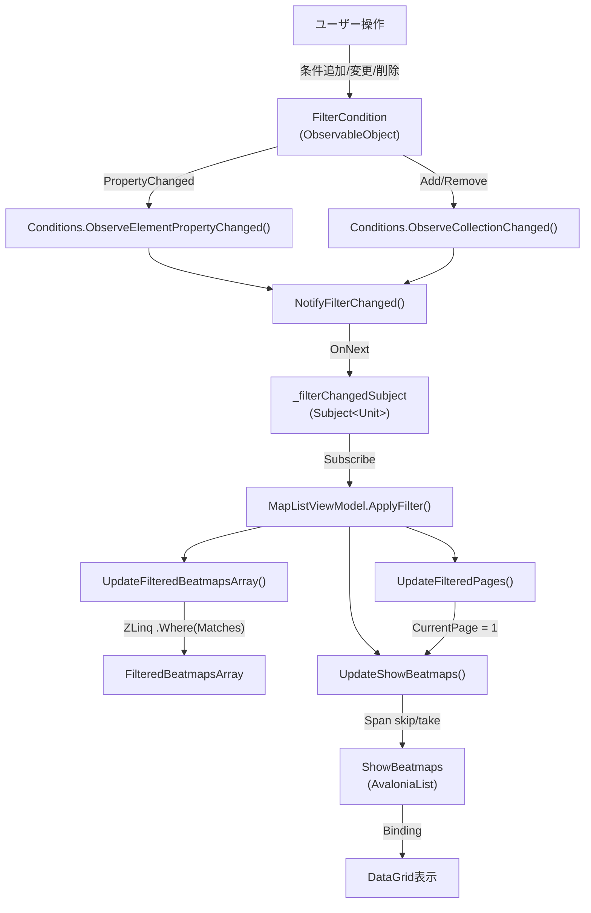
```mermaid
flowchart TD
    U["ユーザー操作"] -->|条件追加/変更/削除| FC["FilterCondition<br/>(ObservableObject)"]
    FC -->|PropertyChanged| OEP["Conditions.ObserveElementPropertyChanged()"]
    FC -->|Add/Remove| OCC["Conditions.ObserveCollectionChanged()"]

    OEP --> NFC["NotifyFilterChanged()"]
    OCC --> NFC

    NFC -->|OnNext| FCS["_filterChangedSubject<br/>(Subject&lt;Unit&gt;)"]
    FCS -->|Subscribe| AF["MapListViewModel.ApplyFilter()"]

    AF --> UF["UpdateFilteredBeatmapsArray()"]
    UF -->|"ZLinq .Where(Matches)"| FB["FilteredBeatmapsArray"]

    AF --> UP["UpdateFilteredPages()"]
    AF --> US["UpdateShowBeatmaps()"]

    UP -->|"CurrentPage = 1"| US
    US -->|"Span skip/take"| SB["ShowBeatmaps<br/>(AvaloniaList)"]
    SB -->|Binding| UI["DataGrid表示"]
```

### フィルタリングの流れ

1. **条件変更検知**: `AvaloniaList<FilterCondition>` の `ObserveCollectionChanged()` と `ObserveElementPropertyChanged()` で変更を検知
2. **変更通知**: `_filterChangedSubject.OnNext(Unit.Default)` でフィルタ変更を通知
3. **フィルタ実行**: `MapListViewModel` が `FilterChanged` を購読し `ApplyFilter()` を呼び出し
4. **ZLinqフィルタ**: `_databaseService.Beatmaps.AsValueEnumerable().Where(x => _filterViewModel.Matches(x))` でフィルタ実行
   - フィルタ対象フィールド: `Title`, `Artist`, `BPM`, `Difficulty`, `OD`, `HP`, `DrainTime`, `KeyCount`, `LongNoteRate`, `Status` など（詳細は [MODULES.md](MODULES.md) 参照）
5. **ページリセット**: `FilteredPages` 更新時に `CurrentPage = 1` にリセット
6. **表示更新**: `Span<Beatmap>` の `skip/take` でページ分のデータを `ShowBeatmaps`（`AvaloniaList`）にセット

### ページング仕様

| ページサイズ | 選択肢 |
|-------------|-------|
| デフォルト | 20 |
| 選択可能 | 10, 20, 50, 100 |

`PageSize` 変更時は `OnPageSizeChanged` → `UpdateFilteredPages()` → `UpdateShowBeatmaps()` の順で更新。

---

## 4. コレクション書き込みフロー

フィルタで絞り込んだ譜面一覧をosu!の `collection.db` に書き込む。

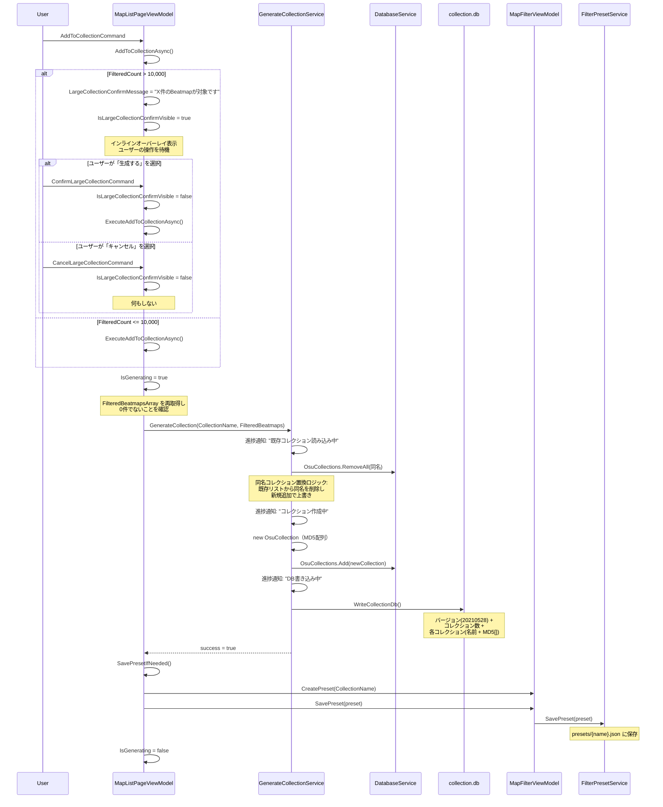
```mermaid
sequenceDiagram
    participant User
    participant MLPVM as MapListPageViewModel
    participant GCS as GenerateCollectionService
    participant DS as DatabaseService
    participant File as collection.db
    participant FVM as MapFilterViewModel
    participant FPS as FilterPresetService

    User->>MLPVM: AddToCollectionCommand
    MLPVM->>MLPVM: AddToCollectionAsync()

    alt FilteredCount > 10,000
        MLPVM->>MLPVM: LargeCollectionConfirmMessage = "X件のBeatmapが対象です"
        MLPVM->>MLPVM: IsLargeCollectionConfirmVisible = true
        Note over MLPVM: インラインオーバーレイ表示<br/>ユーザーの操作を待機
        alt ユーザーが「生成する」を選択
            User->>MLPVM: ConfirmLargeCollectionCommand
            MLPVM->>MLPVM: IsLargeCollectionConfirmVisible = false
            MLPVM->>MLPVM: ExecuteAddToCollectionAsync()
        else ユーザーが「キャンセル」を選択
            User->>MLPVM: CancelLargeCollectionCommand
            MLPVM->>MLPVM: IsLargeCollectionConfirmVisible = false
            Note over MLPVM: 何もしない
        end
    else FilteredCount <= 10,000
        MLPVM->>MLPVM: ExecuteAddToCollectionAsync()
    end

    MLPVM->>MLPVM: IsGenerating = true
    Note over MLPVM: FilteredBeatmapsArray を再取得し<br/>0件でないことを確認

    MLPVM->>GCS: GenerateCollection(CollectionName, FilteredBeatmaps)
    GCS->>GCS: 進捗通知: "既存コレクション読み込み中"
    GCS->>DS: OsuCollections.RemoveAll(同名)
    Note over GCS: 同名コレクション置換ロジック:<br/>既存リストから同名を削除し<br/>新規追加で上書き
    GCS->>GCS: 進捗通知: "コレクション作成中"
    GCS->>GCS: new OsuCollection（MD5配列）
    GCS->>DS: OsuCollections.Add(newCollection)
    GCS->>GCS: 進捗通知: "DB書き込み中"
    GCS->>File: WriteCollectionDb()
    Note over File: バージョン(20210528) +<br/>コレクション数 +<br/>各コレクション(名前 + MD5[])
    GCS-->>MLPVM: success = true

    MLPVM->>MLPVM: SavePresetIfNeeded()
    MLPVM->>FVM: CreatePreset(CollectionName)
    MLPVM->>FVM: SavePreset(preset)
    FVM->>FPS: SavePreset(preset)
    Note over FPS: presets/{name}.json に保存

    MLPVM->>MLPVM: IsGenerating = false
```

### 書き込みフォーマット

collection.dbのバイナリフォーマット:

| フィールド | 型 | 説明 |
|-----------|---|------|
| Version | Int32 | osu!バージョン（20210528） |
| CollectionCount | Int32 | コレクション数 |
| CollectionName | osu!String | 0x0b + ULEB128長 + UTF8バイト列 |
| BeatmapCount | Int32 | コレクション内の譜面数 |
| BeatmapMD5[] | osu!String[] | 各譜面のMD5ハッシュ |

### 同名コレクション置換ロジック

1. メモリ上の `OsuCollections` リストから同名コレクションを `RemoveAll` で削除
2. 新しい `OsuCollection` を `Add` で追加
3. リスト全体を `collection.db` に書き出し（ファイル全体を上書き）

### プリセット自動保存

コレクション保存成功時、コレクション名が指定されておりフィルタ条件が1つ以上ある場合、プリセットを自動保存する。プリセット名 = コレクション名。

---

## 5. オーディオパネル再生フロー

MapListViewの上部に配置される高機能オーディオパネルのデータフロー。簡易版（AudioPlayerViewModel）との切り替えは設定で永続化される。

### 5.1 譜面選択→再生開始フロー

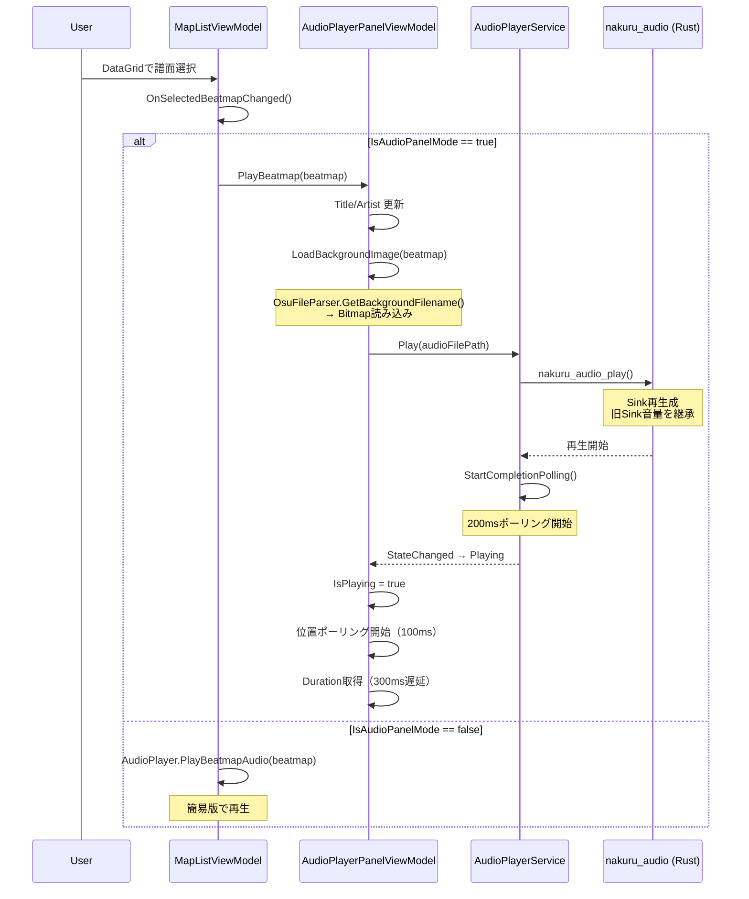
```mermaid
sequenceDiagram
    participant User
    participant MLVM as MapListViewModel
    participant APVM as AudioPlayerPanelViewModel
    participant APS as AudioPlayerService
    participant Rust as nakuru_audio (Rust)

    User->>MLVM: DataGridで譜面選択
    MLVM->>MLVM: OnSelectedBeatmapChanged()
    alt IsAudioPanelMode == true
        MLVM->>APVM: PlayBeatmap(beatmap)
        APVM->>APVM: Title/Artist 更新
        APVM->>APVM: LoadBackgroundImage(beatmap)
        Note over APVM: OsuFileParser.GetBackgroundFilename()<br/>→ Bitmap読み込み
        APVM->>APS: Play(audioFilePath)
        APS->>Rust: nakuru_audio_play()
        Note over Rust: Sink再生成<br/>旧Sink音量を継承
        Rust-->>APS: 再生開始
        APS->>APS: StartCompletionPolling()
        Note over APS: 200msポーリング開始
        APS-->>APVM: StateChanged → Playing
        APVM->>APVM: IsPlaying = true
        APVM->>APVM: 位置ポーリング開始（100ms）
        APVM->>APVM: Duration取得（300ms遅延）
    else IsAudioPanelMode == false
        MLVM->>MLVM: AudioPlayer.PlayBeatmapAudio(beatmap)
        Note over MLVM: 簡易版で再生
    end
```

### 5.2 再生完了→次トラックフロー

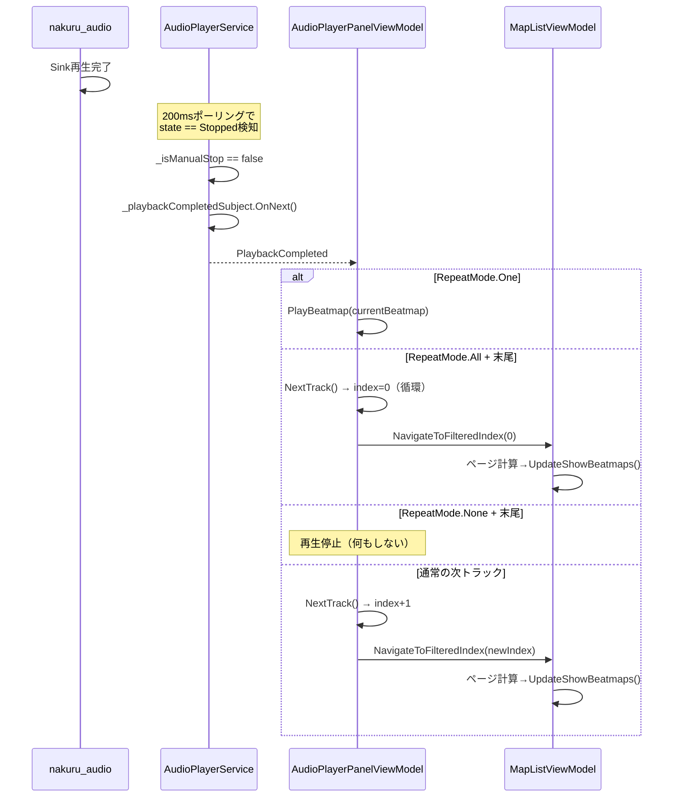
```mermaid
sequenceDiagram
    participant Rust as nakuru_audio
    participant APS as AudioPlayerService
    participant APVM as AudioPlayerPanelViewModel
    participant MLVM as MapListViewModel

    Rust->>Rust: Sink再生完了
    Note over APS: 200msポーリングで<br/>state == Stopped検知
    APS->>APS: _isManualStop == false
    APS->>APS: _playbackCompletedSubject.OnNext()
    APS-->>APVM: PlaybackCompleted

    alt RepeatMode.One
        APVM->>APVM: PlayBeatmap(currentBeatmap)
    else RepeatMode.All + 末尾
        APVM->>APVM: NextTrack() → index=0（循環）
        APVM->>MLVM: NavigateToFilteredIndex(0)
        MLVM->>MLVM: ページ計算→UpdateShowBeatmaps()
    else RepeatMode.None + 末尾
        Note over APVM: 再生停止（何もしない）
    else 通常の次トラック
        APVM->>APVM: NextTrack() → index+1
        APVM->>MLVM: NavigateToFilteredIndex(newIndex)
        MLVM->>MLVM: ページ計算→UpdateShowBeatmaps()
    end
```

### 5.3 背景画像読み込みフロー

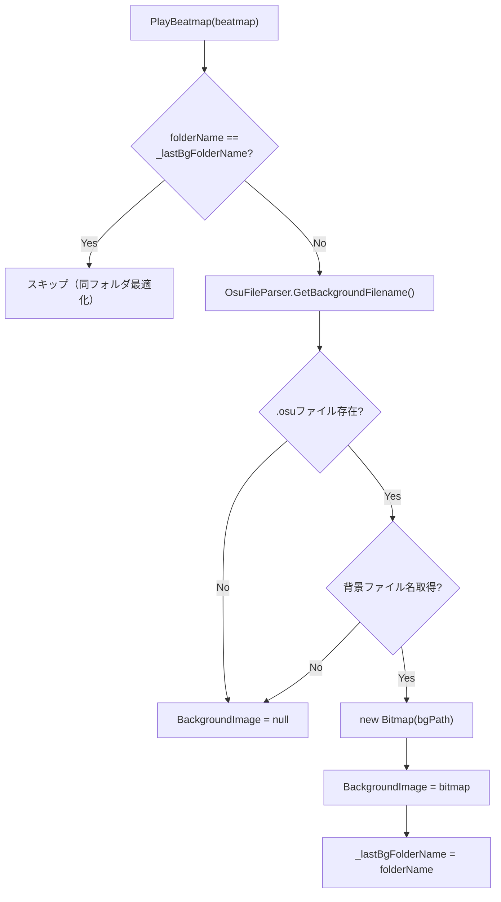
```mermaid
flowchart TD
    PB["PlayBeatmap(beatmap)"] --> CF{"folderName ==<br/>_lastBgFolderName?"}
    CF -->|Yes| SKIP["スキップ（同フォルダ最適化）"]
    CF -->|No| GP["OsuFileParser.GetBackgroundFilename()"]
    GP --> FE{".osuファイル存在?"}
    FE -->|No| NB["BackgroundImage = null"]
    FE -->|Yes| BG{"背景ファイル名取得?"}
    BG -->|No| NB
    BG -->|Yes| IMG["new Bitmap(bgPath)"]
    IMG --> SET["BackgroundImage = bitmap"]
    SET --> UPD["_lastBgFolderName = folderName"]
```

- OsuFileParserは `File.ReadLines` で.osuファイルの[Events]セクションを遅延読み込み
- 同じフォルダ（同Beatmapset）の連続アクセスは `_lastBgFolderName` キャッシュで最適化
- 旧Bitmapは `Dispose()` で解放

### 5.4 モード切替フロー

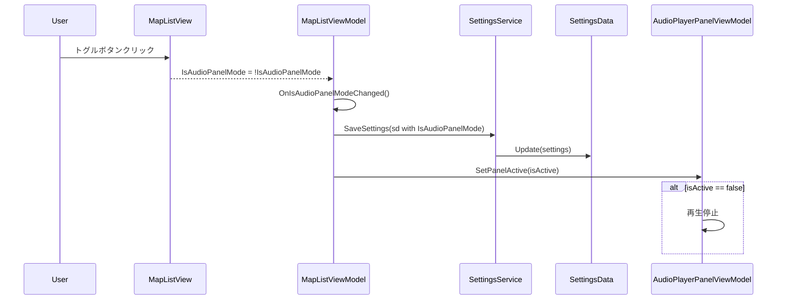
```mermaid
sequenceDiagram
    participant User
    participant MLV as MapListView
    participant MLVM as MapListViewModel
    participant SS as SettingsService
    participant SD as SettingsData
    participant APVM as AudioPlayerPanelViewModel

    User->>MLV: トグルボタンクリック
    MLV-->>MLVM: IsAudioPanelMode = !IsAudioPanelMode
    MLVM->>MLVM: OnIsAudioPanelModeChanged()
    MLVM->>SS: SaveSettings(sd with IsAudioPanelMode)
    SS->>SD: Update(settings)
    MLVM->>APVM: SetPanelActive(isActive)
    alt isActive == false
        APVM->>APVM: 再生停止
    end
```

---

## 6. R3リアクティブチェーン一覧

ソースコードから洗い出した全てのR3購読チェーンの一覧。全購読は `AddTo(Disposables)` によりViewModel/Serviceのライフサイクルに紐づけられ、`Dispose()` 時に自動解除される。

### 6.1 Subject 一覧

| クラス | Subject | 型 | 用途 |
|-------|---------|---|------|
| `DatabaseService` | `_collectionDbProgress` | `Subject<DatabaseLoadProgress>` | collection.db読み込み進捗 |
| `DatabaseService` | `_osuDbProgress` | `Subject<DatabaseLoadProgress>` | osu!.db読み込み進捗 |
| `DatabaseService` | `_scoresDbProgress` | `Subject<DatabaseLoadProgress>` | scores.db読み込み進捗 |
| `GenerateCollectionService` | `_generationProgress` | `Subject<GenerationProgress>` | コレクション生成進捗 |
| `MapFilterViewModel` | `_filterChangedSubject` | `Subject<Unit>` | フィルタ条件変更通知 |
| `AudioPlayerService` | `_stateSubject` | `Subject<AudioPlayerState>` | オーディオ再生状態変更通知 |
| `AudioPlayerService` | `_playbackCompletedSubject` | `Subject<Unit>` | 再生完了の通知（自然終了時のみ） |
| `ImportExportService` | `_progress` | `Subject<ImportExportProgress>` | エクスポート/インポート進捗通知 |
| `ExportViewModel` | `_previewRequestedSubject` | `Subject<ImportExportBeatmapItem[]>` | エクスポートプレビュー行通知（null時は空配列） |
| `ExportViewModel` | `_statusMessageSubject` | `Subject<string>` | エクスポート完了/失敗メッセージ通知 |
| `ImportViewModel` | `_previewRequestedSubject` | `Subject<ImportExportBeatmapItem[]>` | インポートプレビュー行通知（null時は空配列） |
| `ImportViewModel` | `_statusMessageSubject` | `Subject<string>` | インポート完了/失敗メッセージ通知 |
| `ImportViewModel` | `_importCompletedSubject` | `Subject<Unit>` | インポート成功通知（親VMの再初期化トリガー） |

### 6.2 購読チェーン一覧

| # | 発行元 | 購読先 | トリガー | アクション | ライフサイクル |
|---|-------|--------|---------|-----------|--------------|
| 1 | `DatabaseService._collectionDbProgress` | `DatabaseLoadingViewModel` | collection.db進捗変更 | `CollectionDbMessage` / `CollectionDbProgress` 更新 | `AddTo(Disposables)` |
| 2 | `DatabaseService._osuDbProgress` | `DatabaseLoadingViewModel` | osu!.db進捗変更 | `OsuDbMessage` / `OsuDbProgress` 更新 | `AddTo(Disposables)` |
| 3 | `DatabaseService._scoresDbProgress` | `DatabaseLoadingViewModel` | scores.db進捗変更 | `ScoresDbMessage` / `ScoresDbProgress` 更新 | `AddTo(Disposables)` |
| 4 | `SettingsData.OsuFolderPath` | `MainWindowViewModel` | `OsuFolderPath` PropertyChanged | `OnFolderPathChanged()` → `ReloadDatabaseAsync()` | `AddTo(Disposables)` |
| 5 | `MapFilterViewModel._filterChangedSubject` | `MapListViewModel` | フィルタ条件変更 | `ApplyFilter()` | `AddTo(Disposables)` |
| 6 | `MapListViewModel.SelectedBeatmap` | `MapListViewModel` | 譜面選択変更 | `AudioPlayer.PlayBeatmapAudio()` | `AddTo(Disposables)` |
| 7 | `GenerateCollectionService._generationProgress` | `MapListPageViewModel` | コレクション生成進捗 | `GenerationStatusMessage` / `GenerationProgressValue` 更新 | `AddTo(Disposables)` |
| 8 | `MapFilterViewModel.SelectedPreset` | `MapListPageViewModel` | プリセット選択変更 | `CollectionName` をプリセットのコレクション名に更新 | `AddTo(Disposables)` |
| 9 | `FilterPresetService.Presets` (AvaloniaList) | `MapFilterViewModel` | プリセットリスト変更 | `UpdatePresetsWithNone()` | `AddTo(Disposables)` |
| 10 | `MapFilterViewModel.Conditions` (AvaloniaList) | `MapFilterViewModel` | 条件の追加/削除 | `NotifyFilterChanged()` + コマンド状態更新 | `AddTo(Disposables)` |
| 11 | `MapFilterViewModel.Conditions` 要素 | `MapFilterViewModel` | 条件プロパティ変更 | `NotifyFilterChanged()` | `AddTo(Disposables)` |
| 12 | `AudioPlayerService._stateSubject` | `AudioPlayerViewModel` | 再生状態変更 | `IsPlaying` 更新 | `AddTo(Disposables)` |
| 13 | `SettingsData.LanguageKey` | `SettingsService` | 言語キー変更 | `LanguageService.ChangeLanguage()` | `AddTo(_disposables)` |
| 14 | `ImportExportService._progress` | `ImportExportPageViewModel` | エクスポート/インポート進捗変更 | `StatusMessage` / `ProgressValue` 更新 | `AddTo(Disposables)` |
| 15 | `PresetEditorViewModel.EditingConditions` (AvaloniaList) | `PresetEditorViewModel` | 編集条件の追加/削除 | `AddConditionCommand` / `SavePresetCommand` のCanExecute更新 | `AddTo(Disposables)` |
| 16 | `FilterPresetService.Presets` (AvaloniaList) | `PresetEditorViewModel` | プリセットリスト変更 | `BatchGenerateCollectionsCommand` のCanExecute更新 | `AddTo(Disposables)` |
| IE-2 | `ExportViewModel._previewRequestedSubject` | `ImportExportPageViewModel` | Export選択変更（null時は空配列） | `BeatmapListVM.SetPreviewRows(rows, false)` | `AddTo(Disposables)` |
| IE-3 | `ImportViewModel._previewRequestedSubject` | `ImportExportPageViewModel` | Import選択変更（null時は空配列） | `BeatmapListVM.SetPreviewRows(rows, true)` | `AddTo(Disposables)` |
| IE-4 | `ExportViewModel._statusMessageSubject` | `ImportExportPageViewModel` | エクスポート完了/失敗 | `StatusMessage` 更新 | `AddTo(Disposables)` |
| IE-5 | `ImportViewModel._statusMessageSubject` | `ImportExportPageViewModel` | インポート完了/失敗 | `StatusMessage` 更新 | `AddTo(Disposables)` |
| IE-6 | `ImportViewModel._importCompletedSubject` | `ImportExportPageViewModel` | インポート成功 | `Initialize()` 再実行（両子VM再構築 + プレビューリセット） | `AddTo(Disposables)` |
| IE-7 | `ExportViewModel.IsProcessing` ＋ `ImportViewModel.IsProcessing`（Merge） | `ImportExportPageViewModel` | いずれかの処理中フラグ変更 | `IsProcessing` 統合（OR）＋ `IsAnyProcessing` を両子VMに逆流 | `AddTo(Disposables)` |
| IE-8 | `ExportViewModel.SelectedExportCollection` | `ImportExportPageViewModel` | Export選択変更 | 非null時に `ImportViewModel.SelectedImportFile = null`（排他選択） | `AddTo(Disposables)` |
| IE-9 | `ImportViewModel.SelectedImportFile` | `ImportExportPageViewModel` | Import選択変更 | 非null時に `ExportViewModel.SelectedExportCollection = null`（排他選択） | `AddTo(Disposables)` |
| UC-1 | `SettingsData.PreferUnicode` | `MapListViewModel` | `PreferUnicode` PropertyChanged | `UpdateShowBeatmaps()`（DataGrid再構築 → UnicodeDisplayConverter再評価） | `AddTo(Disposables)` |
| UC-2 | `SettingsData.PreferUnicode` | `ImportExportBeatmapListViewModel` | `PreferUnicode` PropertyChanged | `UpdateShowBeatmaps()`（DataGrid再構築 → UnicodeDisplayConverter再評価） | `AddTo(Disposables)` |
| AP-1 | `AudioPlayerService._playbackCompletedSubject` | `AudioPlayerPanelViewModel` | 再生完了（自然終了） | リピートモードに応じた次トラック処理 | `AddTo(Disposables)` |
| AP-2 | `AudioPlayerService._stateSubject` | `AudioPlayerPanelViewModel` | 再生状態変更 | `IsPlaying` 更新 + 位置ポーリング開始/停止 | `AddTo(Disposables)` |
| AP-3 | `MapListViewModel.SelectedBeatmap` | `MapListViewModel` | 譜面選択変更（パネルモード時） | `AudioPlayerPanel.PlayBeatmap()` + ナビゲーションコンテキスト更新 | `AddTo(Disposables)` |
| AP-4 | `SettingsData.IsAudioPanelMode` | `MapListViewModel` | オーディオパネルモード変更 | 設定保存 + `SetPanelActive()` | partial method |

### 6.3 ライフサイクル管理

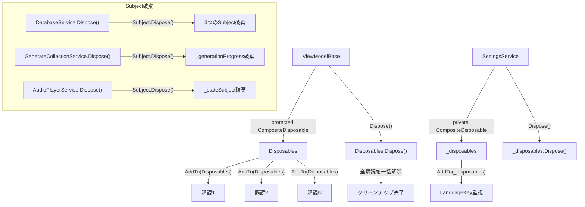
```mermaid
flowchart TD
    VB["ViewModelBase"] -->|"protected CompositeDisposable"| D["Disposables"]
    D -->|"AddTo(Disposables)"| S1["購読1"]
    D -->|"AddTo(Disposables)"| S2["購読2"]
    D -->|"AddTo(Disposables)"| SN["購読N"]

    VB -->|"Dispose()"| DD["Disposables.Dispose()"]
    DD -->|全購読を一括解除| DONE["クリーンアップ完了"]

    SS["SettingsService"] -->|"private CompositeDisposable"| SD["_disposables"]
    SD -->|"AddTo(_disposables)"| SS1["LanguageKey監視"]
    SS -->|"Dispose()"| SDD["_disposables.Dispose()"]

    subgraph Subject破棄
        DS["DatabaseService.Dispose()"] -->|"Subject.Dispose()"| DSS["3つのSubject破棄"]
        GCS["GenerateCollectionService.Dispose()"] -->|"Subject.Dispose()"| GSS["_generationProgress破棄"]
        APS["AudioPlayerService.Dispose()"] -->|"Subject.Dispose()"| ASS["_stateSubject破棄"]
    end
```

- **ViewModelBase**: `CompositeDisposable Disposables` を保持。`Dispose()` で全購読を一括解除
- **SettingsService**: 独自の `CompositeDisposable _disposables` で言語監視のライフサイクルを管理
- **Subject発行元のService**: `Dispose()` 時に各Subjectを明示的に `Dispose()`
- **MapFilterViewModel**: `_filterChangedSubject` 自体も `AddTo(Disposables)` で管理

---

## 7. 設定変更の波及

### 7.1 OsuFolderPath変更時のDB再読み込みチェーン

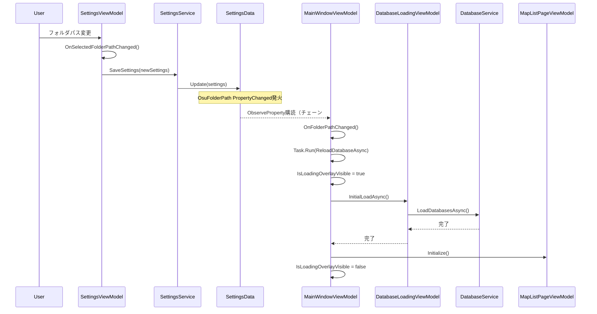
```mermaid
sequenceDiagram
    participant User
    participant SVM as SettingsViewModel
    participant SS as SettingsService
    participant SD as SettingsData
    participant MW as MainWindowViewModel
    participant DL as DatabaseLoadingViewModel
    participant DS as DatabaseService
    participant ML as MapListPageViewModel

    User->>SVM: フォルダパス変更
    SVM->>SVM: OnSelectedFolderPathChanged()
    SVM->>SS: SaveSettings(newSettings)
    SS->>SD: Update(settings)
    Note over SD: OsuFolderPath PropertyChanged発火
    SD-->>MW: ObserveProperty購読（チェーン#4）
    MW->>MW: OnFolderPathChanged()
    MW->>MW: Task.Run(ReloadDatabaseAsync)
    MW->>MW: IsLoadingOverlayVisible = true
    MW->>DL: InitialLoadAsync()
    DL->>DS: LoadDatabasesAsync()
    DS-->>DL: 完了
    DL-->>MW: 完了
    MW->>ML: Initialize()
    MW->>MW: IsLoadingOverlayVisible = false
```

### 7.2 言語変更時のUI更新チェーン

言語変更は2つの経路でUIに波及する。

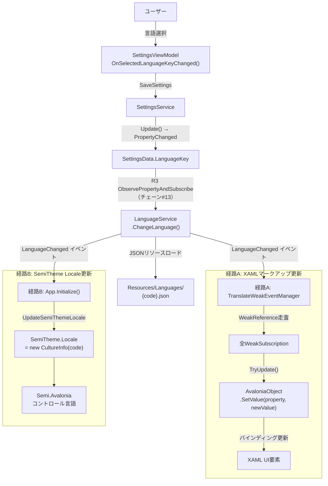
```mermaid
flowchart TD
    User["ユーザー"] -->|言語選択| SVM["SettingsViewModel<br/>OnSelectedLanguageKeyChanged()"]
    SVM -->|SaveSettings| SS["SettingsService"]
    SS -->|"Update() → PropertyChanged"| SD["SettingsData.LanguageKey"]

    SD -->|"R3 ObservePropertyAndSubscribe<br/>（チェーン#13）"| LS["LanguageService<br/>.ChangeLanguage()"]

    LS -->|JSONリソースロード| RES["Resources/Languages/<br/>{code}.json"]
    LS -->|LanguageChanged イベント| E1["経路A: TranslateWeakEventManager"]
    LS -->|LanguageChanged イベント| E2["経路B: App.Initialize()"]

    subgraph 経路A: XAMLマークアップ更新
        E1 -->|WeakReference走査| WS["全WeakSubscription"]
        WS -->|"TryUpdate()"| AO["AvaloniaObject<br/>.SetValue(property, newValue)"]
        AO -->|バインディング更新| UI1["XAML UI要素"]
    end

    subgraph 経路B: SemiTheme Locale更新
        E2 -->|UpdateSemiThemeLocale| ST["SemiTheme.Locale<br/>= new CultureInfo(code)"]
        ST --> UI2["Semi.Avalonia<br/>コントロール言語"]
    end
```

#### 経路A: TranslateExtension → WeakEvent → UI更新

1. `SettingsData.LanguageKey` の PropertyChanged が `SettingsService` の R3購読で検知
2. `LanguageService.ChangeLanguage()` でJSONリソースファイルをロード
3. `LanguageChanged` イベント発火
4. `TranslateWeakEventManager.OnLanguageChanged()` が全 `WeakSubscription` を走査
5. 生存しているAvaloniaObjectの対象プロパティに新しい翻訳値を `SetValue` で反映
6. GCで回収済みのオブジェクトはリストから自動削除（メモリリーク防止）

#### 経路B: SemiTheme Locale更新

1. 同じ `LanguageChanged` イベントを `App.Initialize()` で購読
2. `SemiTheme.Locale` に新しい `CultureInfo` を設定
3. Semi.Avaloniaのビルトインコントロール（ダイアログ等）の言語が更新

### 7.3 PreferUnicode変更時のUnicode表示切替チェーン

Unicode表示の切り替えは `UnicodeDisplayConverter`（IValueConverter）を通じてView層で行う。設定変更時は DataGrid の行を再構築することで Converter を再評価する。

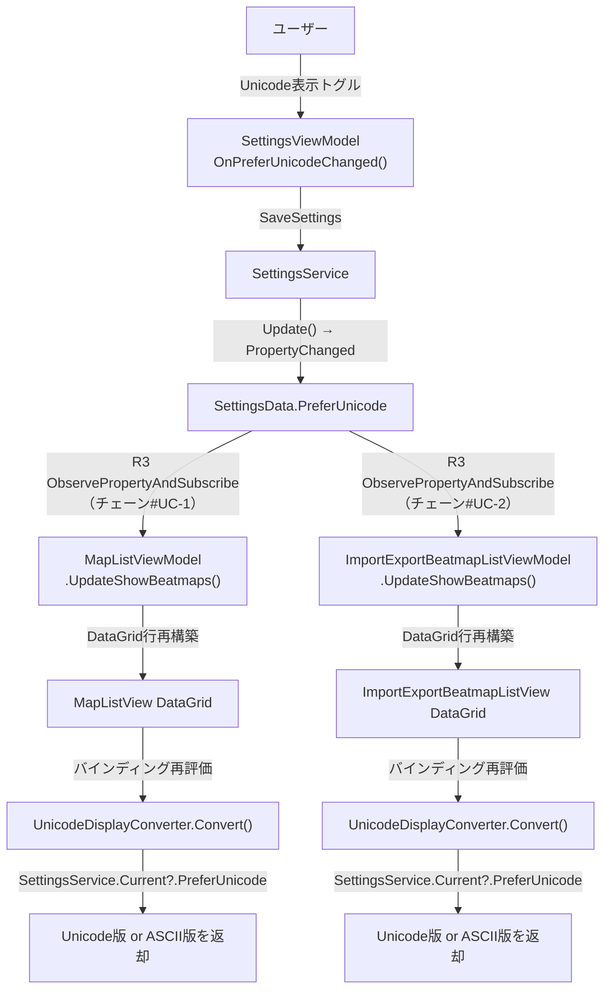
```mermaid
flowchart TD
    User["ユーザー"] -->|"Unicode表示トグル"| SVM["SettingsViewModel<br/>OnPreferUnicodeChanged()"]
    SVM -->|SaveSettings| SS["SettingsService"]
    SS -->|"Update() → PropertyChanged"| SD["SettingsData.PreferUnicode"]

    SD -->|"R3 ObservePropertyAndSubscribe<br/>（チェーン#UC-1）"| MLVM["MapListViewModel<br/>.UpdateShowBeatmaps()"]
    SD -->|"R3 ObservePropertyAndSubscribe<br/>（チェーン#UC-2）"| IEBLVM["ImportExportBeatmapListViewModel<br/>.UpdateShowBeatmaps()"]

    MLVM -->|"DataGrid行再構築"| DG1["MapListView DataGrid"]
    IEBLVM -->|"DataGrid行再構築"| DG2["ImportExportBeatmapListView DataGrid"]

    DG1 -->|"バインディング再評価"| UDC1["UnicodeDisplayConverter.Convert()"]
    DG2 -->|"バインディング再評価"| UDC2["UnicodeDisplayConverter.Convert()"]

    UDC1 -->|"SettingsService.Current?.PreferUnicode"| R1["Unicode版 or ASCII版を返却"]
    UDC2 -->|"SettingsService.Current?.PreferUnicode"| R2["Unicode版 or ASCII版を返却"]
```

- `UnicodeDisplayConverter` は `SettingsService.Current`（internal static）から `PreferUnicode` を参照
- Unicode文字列が空の場合はASCII版にフォールバック
- フィルタ検索は `PreferUnicode` 設定に関係なく常にASCII版・Unicode版の両方をOR検索

### 7.4 テーマ変更時のチェーン

テーマ変更はR3リアクティブチェーンを使用せず、Avaloniaの組み込み機能で直接切り替える。

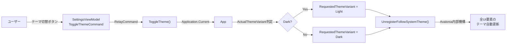
```mermaid
flowchart LR
    User["ユーザー"] -->|テーマ切替ボタン| SVM["SettingsViewModel<br/>ToggleThemeCommand"]
    SVM -->|RelayCommand| TT["ToggleTheme()"]
    TT -->|"Application.Current"| APP["App"]
    APP -->|"ActualThemeVariant判定"| SW{"Dark?"}
    SW -->|Yes| L["RequestedThemeVariant = Light"]
    SW -->|No| D["RequestedThemeVariant = Dark"]
    L --> UR["UnregisterFollowSystemTheme()"]
    D --> UR
    UR -->|Avalonia内部機構| UI["全UI要素の<br/>テーマ自動更新"]
```

テーマ変更は `Application.RequestedThemeVariant` のセッターがAvalonia内部でUI全体のスタイル再評価をトリガーするため、明示的な通知チェーンは不要。`UnregisterFollowSystemTheme()` でシステムのテーマ追従を解除する。

---

## 8. BeatmapGenerator ビートマップリスト表示フロー

BeatmapGenerationPageViewの中央カラムに、選択コレクション内の譜面一覧をDataGridで表示する。

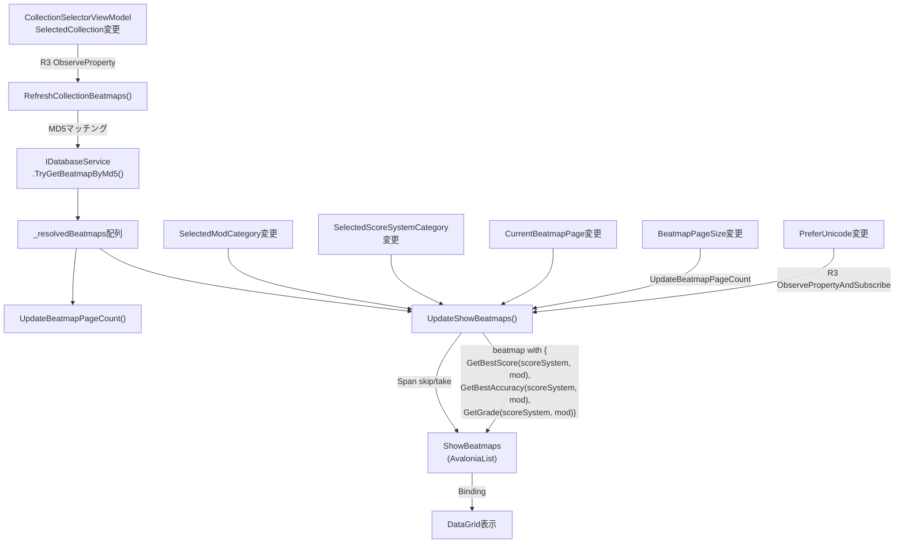
```mermaid
flowchart TD
    CS["CollectionSelectorViewModel<br/>SelectedCollection変更"] -->|R3 ObserveProperty| RC["RefreshCollectionBeatmaps()"]
    RC -->|MD5マッチング| DB["IDatabaseService<br/>.TryGetBeatmapByMd5()"]
    DB --> RB["_resolvedBeatmaps配列"]
    RB --> UPC["UpdateBeatmapPageCount()"]
    RB --> USB["UpdateShowBeatmaps()"]

    MOD["SelectedModCategory変更"] --> USB
    SS["SelectedScoreSystemCategory変更"] --> USB
    PAGE["CurrentBeatmapPage変更"] --> USB
    PSIZE["BeatmapPageSize変更"] -->|UpdateBeatmapPageCount| USB
    PU["PreferUnicode変更"] -->|R3 ObservePropertyAndSubscribe| USB

    USB -->|"Span skip/take"| SB["ShowBeatmaps<br/>(AvaloniaList)"]
    USB -->|"beatmap with {<br/>GetBestScore(scoreSystem, mod),<br/>GetBestAccuracy(scoreSystem, mod),<br/>GetGrade(scoreSystem, mod)}"| SB
    SB -->|Binding| DG["DataGrid表示"]
```

### データフロー詳細

1. **コレクション選択** — `CollectionSelectorViewModel.SelectedCollection` の変更をR3で監視し `RefreshCollectionBeatmaps()` を呼び出し
2. **譜面解決** — コレクション内の各MD5ハッシュで `IDatabaseService.TryGetBeatmapByMd5()` を照合し `_resolvedBeatmaps` 配列を構築
3. **表示更新** — `UpdateShowBeatmaps()` で `Span` スライスによるページ分のデータ取得後、`beatmap with { ... }` でMod/ScoreSystem対応の値に差し替えて `ShowBeatmaps` に転写
4. **Mod/ScoreSystem切替** — `OnSelectedModCategoryChanged` / `OnSelectedScoreSystemCategoryChanged` が `UpdateShowBeatmaps()` を再呼び出し

### 7.5 IsAudioPanelMode変更時のチェーン

オーディオパネルモードの切り替えは`MapListViewModel.OnIsAudioPanelModeChanged()`で処理される。R3リアクティブチェーンではなく、CommunityToolkit.Mvvmの`partial method`パターンを使用。

1. `IsAudioPanelMode` 変更 → `OnIsAudioPanelModeChanged()` 発火
2. 現在の設定を `ISettingsService` から取得し `IsAudioPanelMode` を更新して保存
3. `AudioPlayerPanel.SetPanelActive(value)` を呼び出し
4. パネル無効化時は再生を停止
5. View側では `IsVisible` バインディングでパネルの表示/非表示を切り替え

---

## 8. ImportExportフロー

ImportExportページでは、コレクションをJSONファイルにエクスポート・インポートする。MapListモジュールと同様の親子View/ViewModel構成（**親仲介パターン**）を採用し、子VMが Subject で通知し親VMがオーケストレーションする。

### 8.1 エクスポートフロー

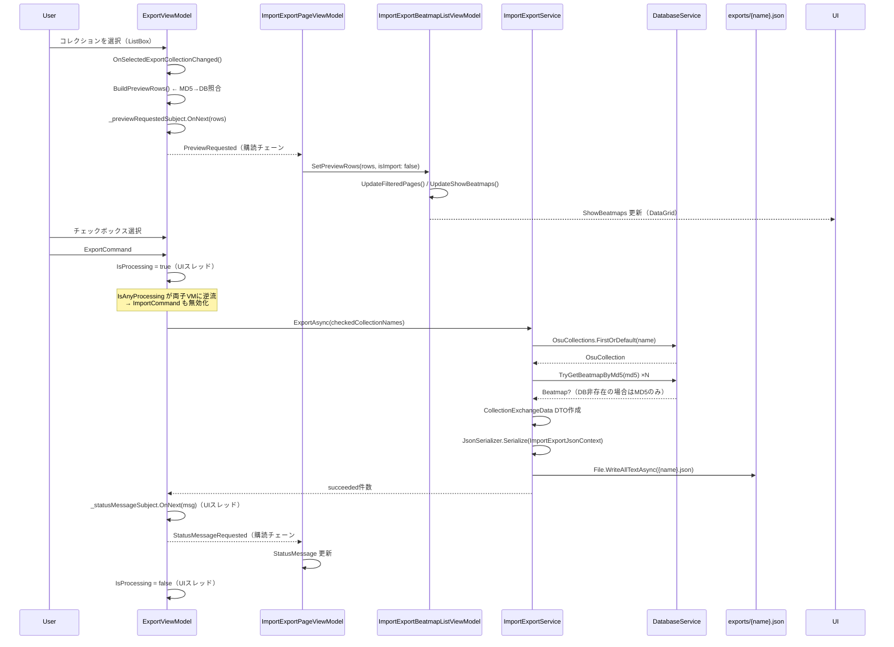
```mermaid
sequenceDiagram
    participant User
    participant EVM as ExportViewModel
    participant IEPVM as ImportExportPageViewModel
    participant BLVM as ImportExportBeatmapListViewModel
    participant IES as ImportExportService
    participant DS as DatabaseService
    participant File as exports/{name}.json

    User->>EVM: コレクションを選択（ListBox）
    EVM->>EVM: OnSelectedExportCollectionChanged()
    EVM->>EVM: BuildPreviewRows() ← MD5→DB照合
    EVM->>EVM: _previewRequestedSubject.OnNext(rows)
    EVM-->>IEPVM: PreviewRequested（購読チェーン#IE-2）
    IEPVM->>BLVM: SetPreviewRows(rows, isImport: false)
    BLVM->>BLVM: UpdateFilteredPages() / UpdateShowBeatmaps()
    BLVM-->>UI: ShowBeatmaps 更新（DataGrid）

    User->>EVM: チェックボックス選択
    User->>EVM: ExportCommand
    EVM->>EVM: IsProcessing = true（UIスレッド）
    Note over EVM: IsAnyProcessing が両子VMに逆流<br/>→ ImportCommand も無効化
    EVM->>IES: ExportAsync(checkedCollectionNames)
    IES->>DS: OsuCollections.FirstOrDefault(name)
    DS-->>IES: OsuCollection
    IES->>DS: TryGetBeatmapByMd5(md5) ×N
    DS-->>IES: Beatmap?（DB非存在の場合はMD5のみ）
    IES->>IES: CollectionExchangeData DTO作成
    IES->>IES: JsonSerializer.Serialize(ImportExportJsonContext)
    IES->>File: File.WriteAllTextAsync({name}.json)
    IES-->>EVM: succeeded件数
    EVM->>EVM: _statusMessageSubject.OnNext(msg)（UIスレッド）
    EVM-->>IEPVM: StatusMessageRequested（購読チェーン#IE-4）
    IEPVM->>IEPVM: StatusMessage 更新
    EVM->>EVM: IsProcessing = false（UIスレッド）
```

### 8.2 インポート選択→プレビュー表示フロー

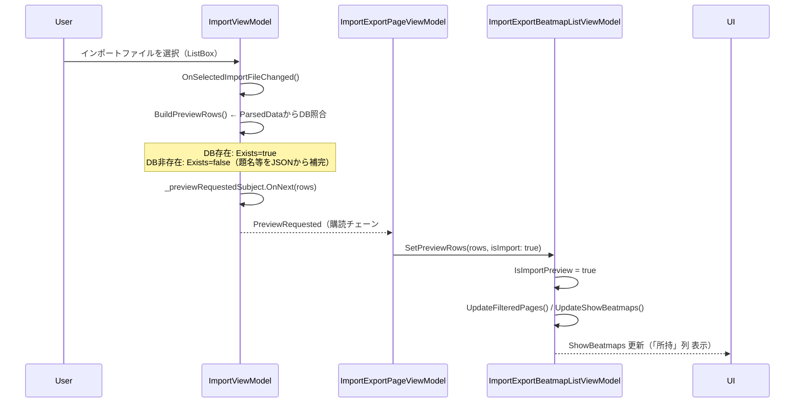
```mermaid
sequenceDiagram
    participant User
    participant IVM as ImportViewModel
    participant IEPVM as ImportExportPageViewModel
    participant BLVM as ImportExportBeatmapListViewModel

    User->>IVM: インポートファイルを選択（ListBox）
    IVM->>IVM: OnSelectedImportFileChanged()
    IVM->>IVM: BuildPreviewRows() ← ParsedDataからDB照合
    Note over IVM: DB存在: Exists=true<br/>DB非存在: Exists=false（題名等をJSONから補完）
    IVM->>IVM: _previewRequestedSubject.OnNext(rows)
    IVM-->>IEPVM: PreviewRequested（購読チェーン#IE-3）
    IEPVM->>BLVM: SetPreviewRows(rows, isImport: true)
    BLVM->>BLVM: IsImportPreview = true
    BLVM->>BLVM: UpdateFilteredPages() / UpdateShowBeatmaps()
    BLVM-->>UI: ShowBeatmaps 更新（「所持」列 表示）
```

### 8.3 インポート実行→再初期化フロー

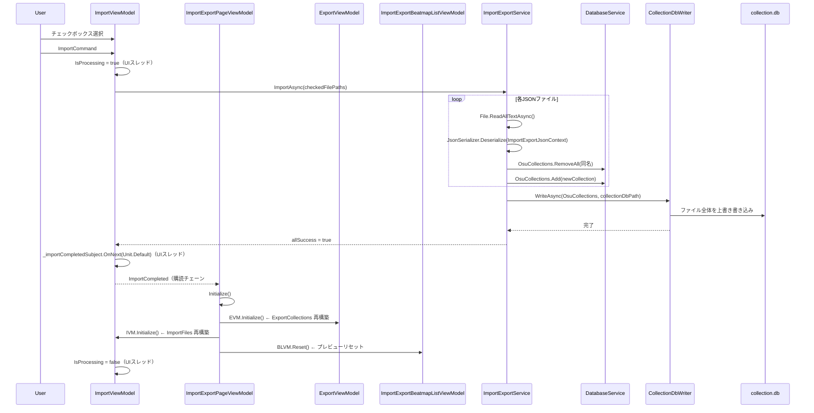
```mermaid
sequenceDiagram
    participant User
    participant IVM as ImportViewModel
    participant IEPVM as ImportExportPageViewModel
    participant EVM as ExportViewModel
    participant BLVM as ImportExportBeatmapListViewModel
    participant IES as ImportExportService
    participant DS as DatabaseService
    participant CDW as CollectionDbWriter
    participant CDB as collection.db

    User->>IVM: チェックボックス選択
    User->>IVM: ImportCommand
    IVM->>IVM: IsProcessing = true（UIスレッド）
    IVM->>IES: ImportAsync(checkedFilePaths)
    loop 各JSONファイル
        IES->>IES: File.ReadAllTextAsync()
        IES->>IES: JsonSerializer.Deserialize(ImportExportJsonContext)
        IES->>DS: OsuCollections.RemoveAll(同名)
        IES->>DS: OsuCollections.Add(newCollection)
    end
    IES->>CDW: WriteAsync(OsuCollections, collectionDbPath)
    CDW->>CDB: ファイル全体を上書き書き込み
    CDW-->>IES: 完了
    IES-->>IVM: allSuccess = true
    IVM->>IVM: _importCompletedSubject.OnNext(Unit.Default)（UIスレッド）
    IVM-->>IEPVM: ImportCompleted（購読チェーン#IE-6）
    IEPVM->>IEPVM: Initialize()
    IEPVM->>EVM: EVM.Initialize() ← ExportCollections 再構築
    IEPVM->>IVM: IVM.Initialize() ← ImportFiles 再構築
    IEPVM->>BLVM: BLVM.Reset() ← プレビューリセット
    IVM->>IVM: IsProcessing = false（UIスレッド）
```

### 8.4 排他選択フロー

Export選択とImport選択は同時に存在できない。親VMがR3で監視し、片方が選択されたら逆側をnullクリアする。

```mermaid
flowchart TD
    EU["Export側を選択"] -->|SelectedExportCollection != null| C8["購読チェーン#IE-8"]
    C8 -->|"ImportViewModel.SelectedImportFile = null"| INC["Import選択クリア"]
    INC -->|OnSelectedImportFileChanged(null)| EAR["空配列をSubject発行"]
    EAR -->|SetPreviewRows([], isImport: true)| BLVM["BeatmapListVM プレビュークリア"]

    IU["Import側を選択"] -->|SelectedImportFile != null| C9["購読チェーン#IE-9"]
    C9 -->|"ExportViewModel.SelectedExportCollection = null"| ENC["Export選択クリア"]
    ENC -->|OnSelectedExportCollectionChanged(null)| EAR2["空配列をSubject発行"]
    EAR2 -->|SetPreviewRows([], isImport: false)| BLVM
```

### 8.5 ドラッグ&ドロップによるインポートファイル追加フロー

`ImportView` にJSON/フォルダをドロップすると、`imports/` フォルダにコピーしてリストをリロードする。

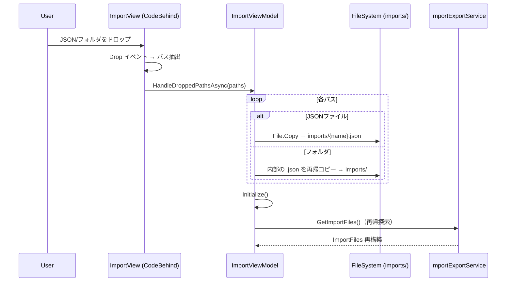
```mermaid
sequenceDiagram
    participant User
    participant IV as ImportView (CodeBehind)
    participant IVM as ImportViewModel
    participant FS as FileSystem (imports/)
    participant IES as ImportExportService

    User->>IV: JSON/フォルダをドロップ
    IV->>IV: Drop イベント → パス抽出
    IV->>IVM: HandleDroppedPathsAsync(paths)
    loop 各パス
        alt JSONファイル
            IVM->>FS: File.Copy → imports/{name}.json
        else フォルダ
            IVM->>FS: 内部の .json を再帰コピー → imports/
        end
    end
    IVM->>IVM: Initialize()
    IVM->>IES: GetImportFiles()（再帰探索）
    IES-->>IVM: ImportFiles 再構築
```

- View（code-behind）はドロップイベントからファイル/フォルダパスの抽出のみを行い、ビジネスロジックはViewModel側で処理する
- `GetImportFiles()` は `SearchOption.AllDirectories` でサブフォルダ内のJSONも探索する

### 8.6 フォルダ構造

| フォルダ | 用途 | 作成タイミング |
|---------|------|--------------|
| `{AppDirectory}/exports/` | エクスポートJSON出力先 | `ExportAsync()` 呼び出し時に自動作成 |
| `{AppDirectory}/imports/` | インポートJSON配置先 | `GetImportFiles()` 呼び出し時に自動作成 |

---

## 9. レート生成フロー（.osz生成パイプライン）

BeatmapGeneratorモジュールによるレート変更版譜面の生成フロー。指定レート範囲で.osuファイルのタイミング変換とオーディオのレート変換を行い、`.osz`（ZIP形式）ファイルとしてSongsフォルダに出力する。.osuファイルおよび関連.osbファイルが参照するすべてのアセット（音声・画像・動画）を解析・収集し、音声ファイルにはレート変換を適用、非音声ファイルはそのままコピーして一つの.oszにパッケージする。

```mermaid
sequenceDiagram
    participant User
    participant VM as RateGenerationViewModel
    participant BRG as BeatmapRateGenerator
    participant OFAP as OsuFileAssetParser
    participant ARC as FfmpegAudioRateChanger
    participant OFC as OsuFileRateConverter
    participant FS as FileSystem (tempDir)
    participant ZIP as ZipFile
    participant Songs as Songs/{folder}.osz

    User->>VM: 生成実行
    VM->>BRG: GenerateAsync(options, progress, ct)

    loop 各レート（min → max, step刻み）
        Note over BRG: 1. .osuファイルパース
        BRG->>OFAP: Parse(osuFilePath)
        OFAP-->>BRG: OsuReferencedAssets

        Note over BRG: 2. 参照アセット収集
        BRG->>BRG: audioNameMap / sampleNameMap 構築
        Note over BRG: MainAudio → 変換後ファイル名<br/>SampleAudioFiles → リネーム後ファイル名

        Note over BRG: 3. メインオーディオのレート変換
        BRG->>ARC: ChangeRateAsync(mainAudio, rate, tempDir)
        ARC-->>BRG: 変換済みオーディオ → tempDir

        Note over BRG: 4. ヒットサウンドのレート変換+リネーム
        loop 各サンプル音声ファイル
            BRG->>ARC: ChangeRateAsync(sample, rate, tempDir/renamed)
            ARC-->>BRG: 変換済みサンプル（リネーム後）
            BRG->>FS: 原音もtempDirにコピー（元ファイル名で保持）
        end

        Note over BRG: 5. 非オーディオファイルのコピー
        BRG->>FS: 背景画像・動画・スプライト等をtempDirにコピー

        Note over BRG: 6. .osuファイル変換（SampleFilenameMap適用）
        BRG->>OFC: ConvertAsync(osuFilePath, rate, options)
        Note over OFC: タイミング・ノート・BPM変換<br/>+ SampleFilenameMapでヒットサウンド参照を更新
        OFC-->>BRG: 変換済み.osu → tempDir

        Note over BRG: 7. tempDir → .osz<br/>既存 .osz がある場合は<br/>Update モードで不足エントリのみ追加マージ<br/>（同名エントリは既存優先でスキップ）
        BRG->>ZIP: ZipFile.CreateFromDirectory(tempDir, oszTmpPath)
        ZIP-->>BRG: .osz.tmp 作成<br/>（既存 .osz がある場合は File.Copy 後 ZipArchiveMode.Update で開きマージ。<br/>InvalidDataException 時は新規作成へフォールバック）

        Note over BRG: 8. atomic File.Move で最終配置
        BRG->>Songs: File.Move(oszTmpPath, oszPath, overwrite: true)
    end

    BRG->>BRG: BatchGenerationResult集計
    BRG-->>VM: 完了（成功/スキップ/失敗件数）
    VM-->>User: 結果表示
```

### 処理の流れ

1. **ユーザー操作** — コレクション選択または単一譜面指定 → レート範囲・ステップ・モード（DT/NC）を設定 → 生成開始
2. **.osuファイルパース** — `OsuFileAssetParser.Parse()` が.osuファイルおよび関連.osbファイルを解析し、`OsuReferencedAssets`（メインオーディオ / サンプル音声 / 非音声ファイル）を返す
3. **参照アセット収集** — `MainAudioFilename` → 変換後ファイル名の `audioNameMap` と、`SampleAudioFiles` → リネーム後ファイル名の `sampleNameMap` を構築（命名規則: `BuildAudioFileName()` を流用、例: `F5S_s.wav` → `F5S_s_1.25x_dt.wav`）
4. **メインオーディオのレート変換** — `FfmpegAudioRateChanger` が FFmpeg subprocess を起動してレート変換を行い、一時ディレクトリに出力
   - **DTモード（デフォルト）**: FFmpeg `atempo` フィルターチェーンによるピッチ保持テンポ変更（`atempo` の有効範囲 0.5–2.0 を超える倍率は複数段のチェーンに分解）
   - **NCモード**: FFmpeg `asetrate` + `aresample` によるサンプルレート変更（ピッチ変更を伴う）
5. **ヒットサウンドのレート変換+リネーム** — `SampleAudioFiles` の各ファイルをメインオーディオと同じレート・モードで変換し、リネーム後のファイル名で一時ディレクトリに出力。変換元の原音も元ファイル名でコピーして保持する。変換失敗時は原音をリネーム後のファイル名でコピー（フォールバック）
6. **非音声ファイルのコピー** — `NonAudioFiles`（背景画像・動画・スプライト・.osbファイル等）を元フォルダから一時ディレクトリにコピー。サブディレクトリ構造を維持
7. **.osuファイル変換** — `OsuFileRateConverter` がタイミングポイント、ノート配置、BPM、難易度名等をレートに応じて変換。`SampleFilenameMap` によりSampleイベント行およびHitObjectのヒットサウンド参照をリネーム後のファイル名に更新
8. **.osz作成** — `ZipFile.CreateFromDirectory()` で一時ディレクトリからoszTmpPathに.oszを生成後、`File.Move()` で最終パスにatomicに配置。一時ディレクトリとoszTmpPathはfinallyブロックで確実に削除
   - **既存 .osz が存在する場合のマージ動作** — 出力先 `Songs/{folderName}.osz` が既に存在する場合は、`File.Copy` で作業用コピー（oszTmpPath）を作成し `ZipArchiveMode.Update` で開く。既存エントリの `FullName` を `/` 区切りに正規化し大文字小文字を無視した集合を作り、tempDir 内のファイルのうちその集合に含まれない**不足エントリのみを追加**する（同名エントリは既存優先でスキップ＝上書きしない）。マージ完了後に `File.Move(overwrite: true)` で最終配置する。既存 .osz が破損等で `InvalidDataException` により開けない場合のみ、従来どおり `ZipFile.CreateFromDirectory` による新規作成にフォールバックする

### .osz内の構成例

```
example_beatmap.osz
├── audio_1.25x_dt.mp3        ← メインオーディオ（レート変換済み）
├── F5S_s.wav                  ← ヒットサウンド原音（そのままコピー）
├── F5S_s_1.25x_dt.wav         ← ヒットサウンド（レート変換+リネーム済み）
├── bg.jpg                     ← 背景画像（そのままコピー）
├── storyboard.osb             ← ストーリーボード（そのままコピー）
└── example [1.25x DT].osu     ← 変換済み.osu（ヒットサウンド参照はリネーム後を指す）
```

### 出力形式の自動選択

入力ファイルの拡張子に応じて出力形式が自動選択される。MP3 / OGG / WAV のエンコードは FFmpeg を subprocess として呼び出し、それぞれ `libmp3lame` / `libvorbis` / `pcm_s16le` コーデックで出力する。MP3 出力時は純 C# パーサー（`AudioInputMetadataReader`）で事前にチャンネル数を取得し、3ch 以上の場合は OGG にフォールバックする。メインオーディオ・サンプル音声ともに同じルールが適用される。

| 入力形式 | チャンネル数 | 出力形式 | エンコーダ |
|---------|------------|---------|----------|
| `.mp3` | 1-2ch | `.mp3` | FFmpeg `libmp3lame`（VBR品質: 標準=`-q:a 4` / 高品質=`-q:a 0`） |
| `.mp3` | 3ch以上 | `.ogg` | FFmpeg `libvorbis`（`AudioInputMetadataReader` による事前チャンネル数プローブ結果によるフォールバック） |
| `.ogg` | 任意 | `.ogg` | FFmpeg `libvorbis` |
| `.wav` | 任意 | `.wav` | FFmpeg `pcm_s16le` |