# データフローと状態管理

> osu! beatmapコレクション編集ツール「NakuruTool」におけるデータの流れ、R3リアクティブチェーン、状態管理の全体像を解説する。

関連ドキュメント: [ARCHITECTURE.md](ARCHITECTURE.md) | [MODULES.md](MODULES.md) | [BUILD.md](BUILD.md)

---

## 1. アプリケーション起動フロー

アプリケーションは `Program.Main` からAvaloniaのライフサイクルに沿って起動し、Pure.DIの `Composition` クラスで全サービス・ViewModelを解決する。

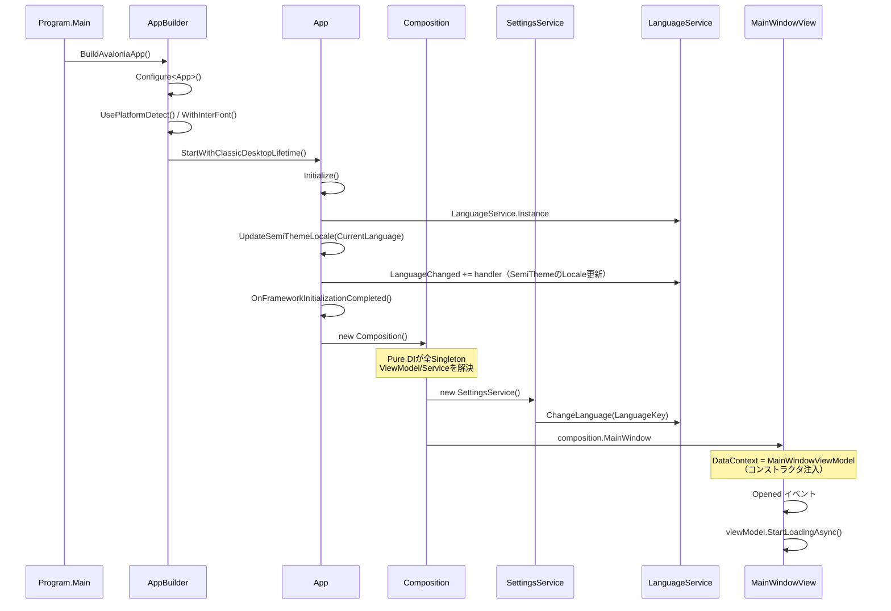

### 起動時の初期化順序

1. `Program.Main` → `AppBuilder.Configure<App>()` でAvaloniaアプリを構成
2. `App.Initialize()` で言語サービス初期化・SemiTheme Locale設定・言語変更イベント購読
3. `App.OnFrameworkInitializationCompleted()` で `Composition` をインスタンス化
4. Pure.DIが依存グラフを解決し `MainWindowView` を生成（DataContextに `MainWindowViewModel` を注入）
5. ウィンドウの `Opened` イベントで `StartLoadingAsync()` を呼び出し、DB読み込みを開始

---

## 2. DB読み込みフロー

`MainWindowViewModel.StartLoadingAsync()` を起点に、3つのDBファイルを並列読み込みし、スコアデータをBeatmapに統合する。

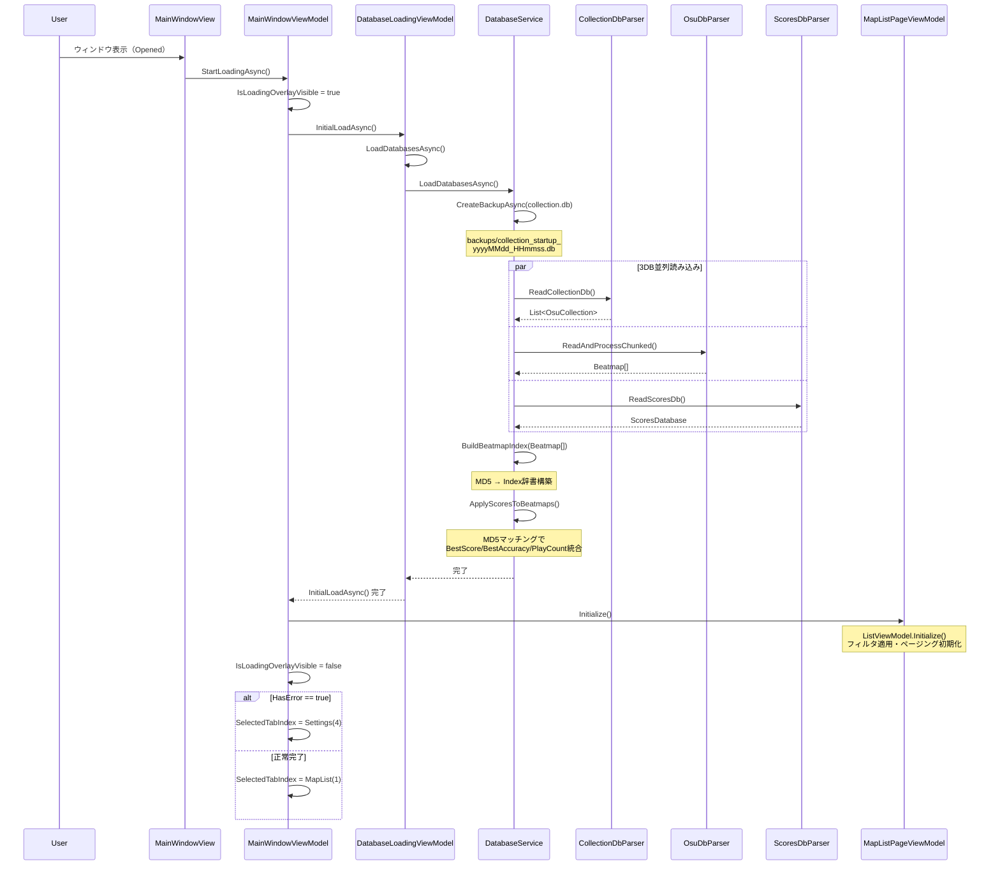

### 読み込み詳細

#### バックアップ作成
- `collection.db` のバックアップを `backups/collection_startup_{timestamp}.db` に作成
- アプリ起動時に1回のみ実行

#### 3DB並列読み込み
`Task.WhenAll` で以下の3パーサーを並列実行：

| DBファイル | パーサー | 出力 |
|-----------|---------|------|
| collection.db | `CollectionDbParser` | `List<OsuCollection>` |
| osu!.db | `OsuDbParser` | `Beatmap[]` |
| scores.db | `ScoresDbParser` | `ScoresDatabase` |

#### スコアデータ統合
1. `Beatmap[]` からMD5ハッシュ → インデックスの辞書を構築
2. `ScoresDatabase` の各エントリのMD5ハッシュで辞書を検索
3. マッチしたBeatmapに `BestScore` / `BestAccuracy` / `PlayCount` を統合（recordの `with` 式で更新）

#### 進捗通知（3系統）
`DatabaseService` は3つの `Subject<DatabaseLoadProgress>` を持ち、各パーサーの進捗を `Dispatcher.UIThread.Post` 経由でUIスレッドに通知する。

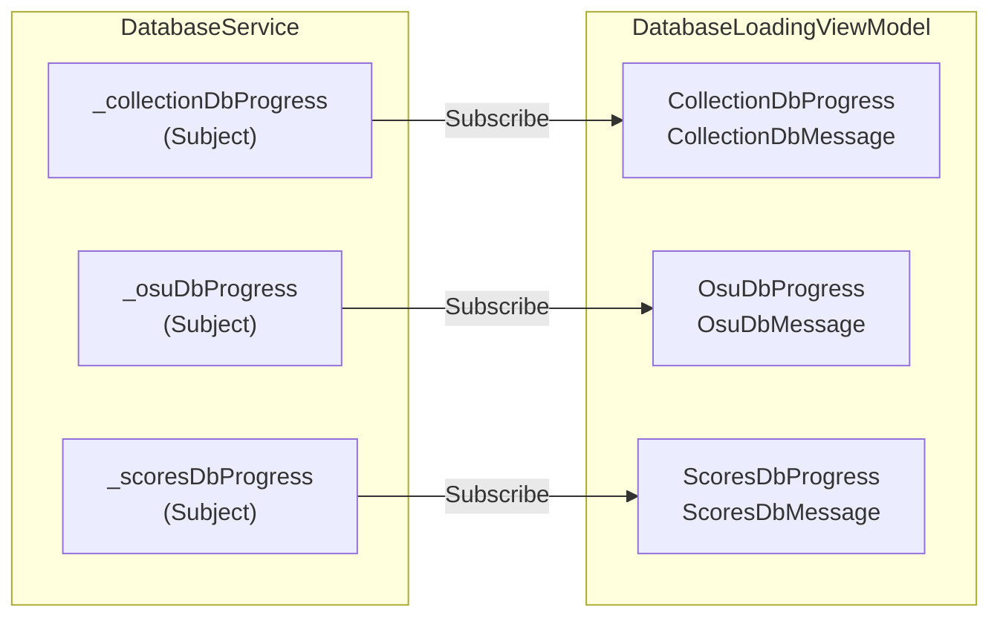

---

## 3. フィルタリングフロー

ユーザーがフィルタ条件を操作すると、R3リアクティブチェーンを通じて譜面一覧が自動更新される。

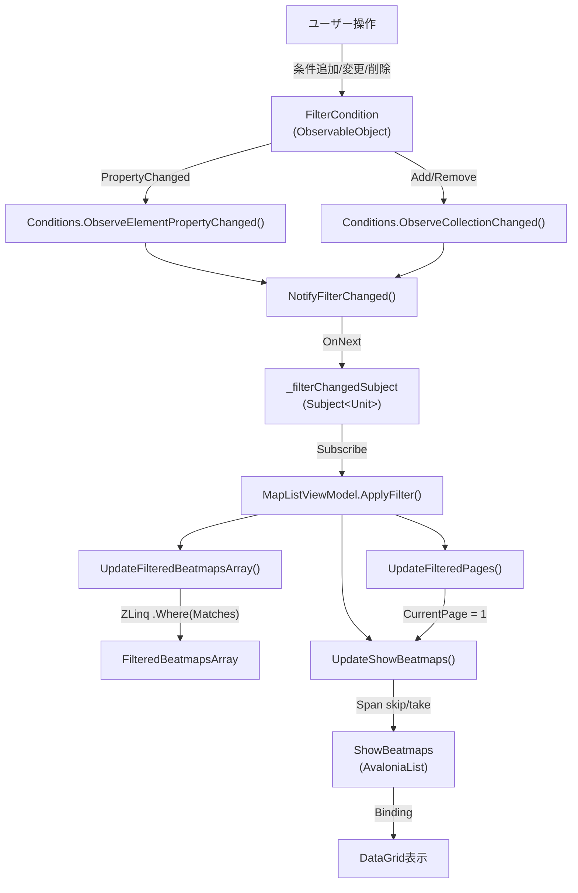

### フィルタリングの流れ

1. **条件変更検知**: `AvaloniaList<FilterCondition>` の `ObserveCollectionChanged()` と `ObserveElementPropertyChanged()` で変更を検知
2. **変更通知**: `_filterChangedSubject.OnNext(Unit.Default)` でフィルタ変更を通知
3. **フィルタ実行**: `MapListViewModel` が `FilterChanged` を購読し `ApplyFilter()` を呼び出し
4. **ZLinqフィルタ**: `_databaseService.Beatmaps.AsValueEnumerable().Where(x => _filterViewModel.Matches(x))` でフィルタ実行
5. **ページリセット**: `FilteredPages` 更新時に `CurrentPage = 1` にリセット
6. **表示更新**: `Span<Beatmap>` の `skip/take` でページ分のデータを `ShowBeatmaps`（`AvaloniaList`）にセット

### ページング仕様

| ページサイズ | 選択肢 |
|-------------|-------|
| デフォルト | 20 |
| 選択可能 | 10, 20, 50, 100 |

`PageSize` 変更時は `OnPageSizeChanged` → `UpdateFilteredPages()` → `UpdateShowBeatmaps()` の順で更新。

---

## 4. コレクション書き込みフロー

フィルタで絞り込んだ譜面一覧をosu!の `collection.db` に書き込む。

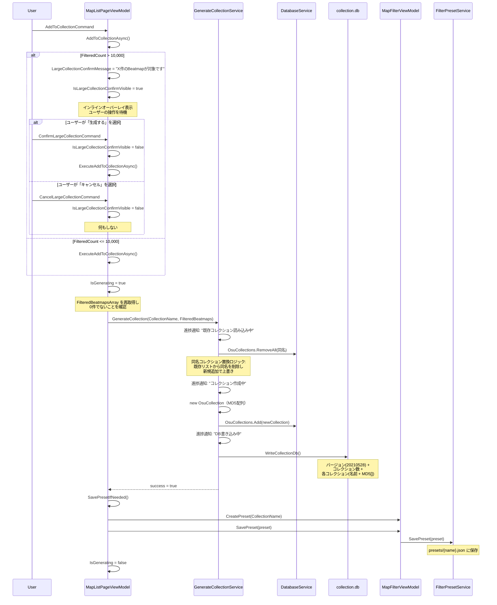

### 書き込みフォーマット

collection.dbのバイナリフォーマット:

| フィールド | 型 | 説明 |
|-----------|---|------|
| Version | Int32 | osu!バージョン（20210528） |
| CollectionCount | Int32 | コレクション数 |
| CollectionName | osu!String | 0x0b + ULEB128長 + UTF8バイト列 |
| BeatmapCount | Int32 | コレクション内の譜面数 |
| BeatmapMD5[] | osu!String[] | 各譜面のMD5ハッシュ |

### 同名コレクション置換ロジック

1. メモリ上の `OsuCollections` リストから同名コレクションを `RemoveAll` で削除
2. 新しい `OsuCollection` を `Add` で追加
3. リスト全体を `collection.db` に書き出し（ファイル全体を上書き）

### プリセット自動保存

コレクション保存成功時、コレクション名が指定されておりフィルタ条件が1つ以上ある場合、プリセットを自動保存する。プリセット名 = コレクション名。

---

## 5. R3リアクティブチェーン一覧

ソースコードから洗い出した全てのR3購読チェーンの一覧。全購読は `AddTo(Disposables)` によりViewModel/Serviceのライフサイクルに紐づけられ、`Dispose()` 時に自動解除される。

### 5.1 Subject 一覧

| クラス | Subject | 型 | 用途 |
|-------|---------|---|------|
| `DatabaseService` | `_collectionDbProgress` | `Subject<DatabaseLoadProgress>` | collection.db読み込み進捗 |
| `DatabaseService` | `_osuDbProgress` | `Subject<DatabaseLoadProgress>` | osu!.db読み込み進捗 |
| `DatabaseService` | `_scoresDbProgress` | `Subject<DatabaseLoadProgress>` | scores.db読み込み進捗 |
| `GenerateCollectionService` | `_generationProgress` | `Subject<GenerationProgress>` | コレクション生成進捗 |
| `MapFilterViewModel` | `_filterChangedSubject` | `Subject<Unit>` | フィルタ条件変更通知 |
| `AudioPlayerService` | `_stateSubject` | `Subject<AudioPlayerState>` | オーディオ再生状態変更通知 |
| `ImportExportService` | `_progress` | `Subject<ImportExportProgress>` | エクスポート/インポート進捗通知 |
| `ExportViewModel` | `_previewRequestedSubject` | `Subject<ImportExportBeatmapItem[]>` | エクスポートプレビュー行通知（null時は空配列） |
| `ExportViewModel` | `_statusMessageSubject` | `Subject<string>` | エクスポート完了/失敗メッセージ通知 |
| `ImportViewModel` | `_previewRequestedSubject` | `Subject<ImportExportBeatmapItem[]>` | インポートプレビュー行通知（null時は空配列） |
| `ImportViewModel` | `_statusMessageSubject` | `Subject<string>` | インポート完了/失敗メッセージ通知 |
| `ImportViewModel` | `_importCompletedSubject` | `Subject<Unit>` | インポート成功通知（親VMの再初期化トリガー） |

### 5.2 購読チェーン一覧

| # | 発行元 | 購読先 | トリガー | アクション | ライフサイクル |
|---|-------|--------|---------|-----------|--------------|
| 1 | `DatabaseService._collectionDbProgress` | `DatabaseLoadingViewModel` | collection.db進捗変更 | `CollectionDbMessage` / `CollectionDbProgress` 更新 | `AddTo(Disposables)` |
| 2 | `DatabaseService._osuDbProgress` | `DatabaseLoadingViewModel` | osu!.db進捗変更 | `OsuDbMessage` / `OsuDbProgress` 更新 | `AddTo(Disposables)` |
| 3 | `DatabaseService._scoresDbProgress` | `DatabaseLoadingViewModel` | scores.db進捗変更 | `ScoresDbMessage` / `ScoresDbProgress` 更新 | `AddTo(Disposables)` |
| 4 | `SettingsData.OsuFolderPath` | `MainWindowViewModel` | `OsuFolderPath` PropertyChanged | `OnFolderPathChanged()` → `ReloadDatabaseAsync()` | `AddTo(Disposables)` |
| 5 | `MapFilterViewModel._filterChangedSubject` | `MapListViewModel` | フィルタ条件変更 | `ApplyFilter()` | `AddTo(Disposables)` |
| 6 | `MapListViewModel.SelectedBeatmap` | `MapListViewModel` | 譜面選択変更 | `AudioPlayer.PlayBeatmapAudio()` | `AddTo(Disposables)` |
| 7 | `GenerateCollectionService._generationProgress` | `MapListPageViewModel` | コレクション生成進捗 | `GenerationStatusMessage` / `GenerationProgressValue` 更新 | `AddTo(Disposables)` |
| 8 | `MapFilterViewModel.SelectedPreset` | `MapListPageViewModel` | プリセット選択変更 | `CollectionName` をプリセットのコレクション名に更新 | `AddTo(Disposables)` |
| 9 | `FilterPresetService.Presets` (AvaloniaList) | `MapFilterViewModel` | プリセットリスト変更 | `UpdatePresetsWithNone()` | `AddTo(Disposables)` |
| 10 | `MapFilterViewModel.Conditions` (AvaloniaList) | `MapFilterViewModel` | 条件の追加/削除 | `NotifyFilterChanged()` + コマンド状態更新 | `AddTo(Disposables)` |
| 11 | `MapFilterViewModel.Conditions` 要素 | `MapFilterViewModel` | 条件プロパティ変更 | `NotifyFilterChanged()` | `AddTo(Disposables)` |
| 12 | `AudioPlayerService._stateSubject` | `AudioPlayerViewModel` | 再生状態変更 | `IsPlaying` 更新 | `AddTo(Disposables)` |
| 13 | `SettingsData.LanguageKey` | `SettingsService` | 言語キー変更 | `LanguageService.ChangeLanguage()` | `AddTo(_disposables)` |
| 14 | `ImportExportService._progress` | `ImportExportPageViewModel` | エクスポート/インポート進捗変更 | `StatusMessage` / `ProgressValue` 更新 | `AddTo(Disposables)` |
| 15 | `PresetEditorViewModel.EditingConditions` (AvaloniaList) | `PresetEditorViewModel` | 編集条件の追加/削除 | `AddConditionCommand` / `SavePresetCommand` のCanExecute更新 | `AddTo(Disposables)` |
| 16 | `FilterPresetService.Presets` (AvaloniaList) | `PresetEditorViewModel` | プリセットリスト変更 | `BatchGenerateCollectionsCommand` のCanExecute更新 | `AddTo(Disposables)` |
| IE-2 | `ExportViewModel._previewRequestedSubject` | `ImportExportPageViewModel` | Export選択変更（null時は空配列） | `BeatmapListVM.SetPreviewRows(rows, false)` | `AddTo(Disposables)` |
| IE-3 | `ImportViewModel._previewRequestedSubject` | `ImportExportPageViewModel` | Import選択変更（null時は空配列） | `BeatmapListVM.SetPreviewRows(rows, true)` | `AddTo(Disposables)` |
| IE-4 | `ExportViewModel._statusMessageSubject` | `ImportExportPageViewModel` | エクスポート完了/失敗 | `StatusMessage` 更新 | `AddTo(Disposables)` |
| IE-5 | `ImportViewModel._statusMessageSubject` | `ImportExportPageViewModel` | インポート完了/失敗 | `StatusMessage` 更新 | `AddTo(Disposables)` |
| IE-6 | `ImportViewModel._importCompletedSubject` | `ImportExportPageViewModel` | インポート成功 | `Initialize()` 再実行（両子VM再構築 + プレビューリセット） | `AddTo(Disposables)` |
| IE-7 | `ExportViewModel.IsProcessing` ＋ `ImportViewModel.IsProcessing`（Merge） | `ImportExportPageViewModel` | いずれかの処理中フラグ変更 | `IsProcessing` 統合（OR）＋ `IsAnyProcessing` を両子VMに逆流 | `AddTo(Disposables)` |
| IE-8 | `ExportViewModel.SelectedExportCollection` | `ImportExportPageViewModel` | Export選択変更 | 非null時に `ImportViewModel.SelectedImportFile = null`（排他選択） | `AddTo(Disposables)` |
| IE-9 | `ImportViewModel.SelectedImportFile` | `ImportExportPageViewModel` | Import選択変更 | 非null時に `ExportViewModel.SelectedExportCollection = null`（排他選択） | `AddTo(Disposables)` |
| UC-1 | `SettingsData.PreferUnicode` | `MapListViewModel` | `PreferUnicode` PropertyChanged | `UpdateShowBeatmaps()`（DataGrid再構築 → UnicodeDisplayConverter再評価） | `AddTo(Disposables)` |
| UC-2 | `SettingsData.PreferUnicode` | `ImportExportBeatmapListViewModel` | `PreferUnicode` PropertyChanged | `UpdateShowBeatmaps()`（DataGrid再構築 → UnicodeDisplayConverter再評価） | `AddTo(Disposables)` |

### 5.3 ライフサイクル管理

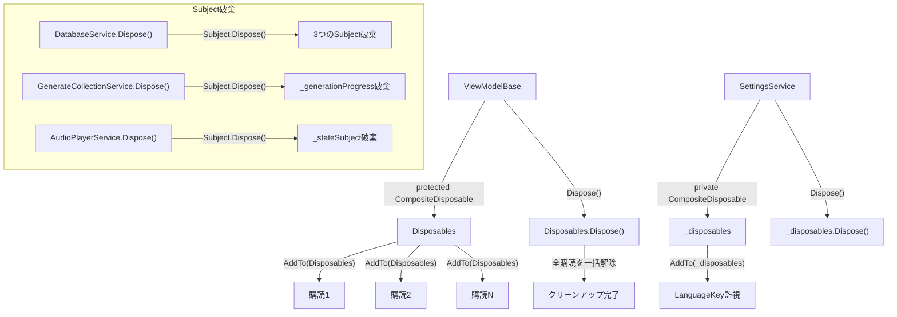

- **ViewModelBase**: `CompositeDisposable Disposables` を保持。`Dispose()` で全購読を一括解除
- **SettingsService**: 独自の `CompositeDisposable _disposables` で言語監視のライフサイクルを管理
- **Subject発行元のService**: `Dispose()` 時に各Subjectを明示的に `Dispose()`
- **MapFilterViewModel**: `_filterChangedSubject` 自体も `AddTo(Disposables)` で管理

---

## 6. 設定変更の波及

### 6.1 OsuFolderPath変更時のDB再読み込みチェーン

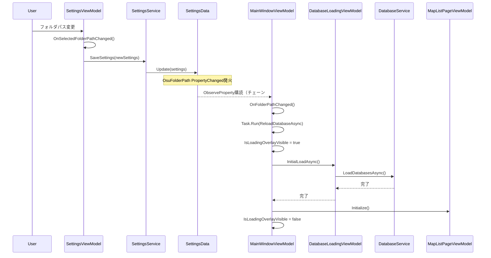

### 6.2 言語変更時のUI更新チェーン

言語変更は2つの経路でUIに波及する。

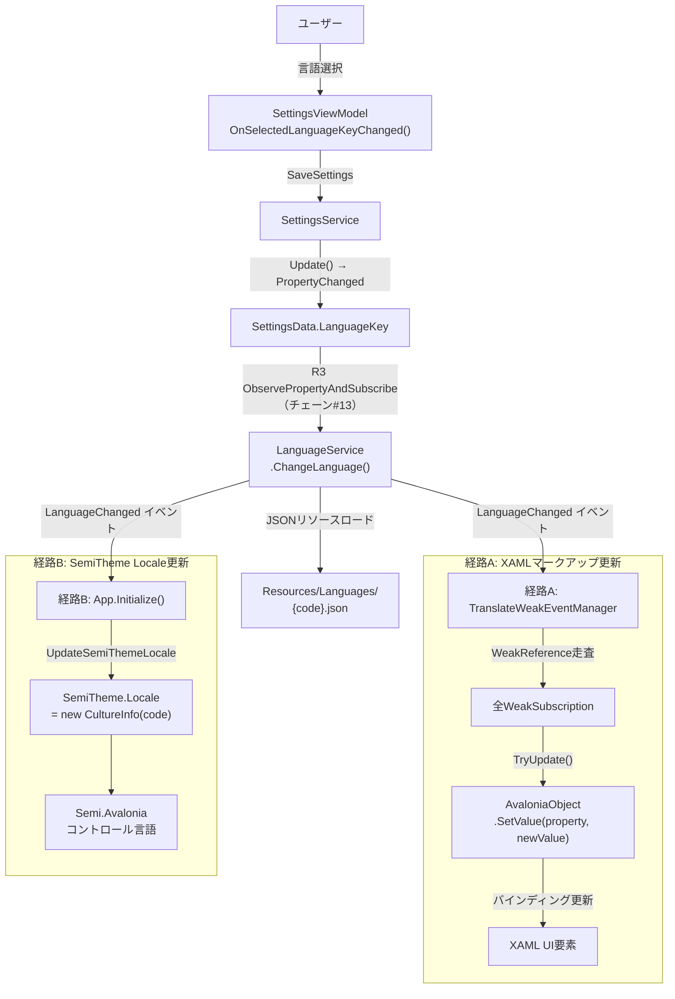

#### 経路A: TranslateExtension → WeakEvent → UI更新

1. `SettingsData.LanguageKey` の PropertyChanged が `SettingsService` の R3購読で検知
2. `LanguageService.ChangeLanguage()` でJSONリソースファイルをロード
3. `LanguageChanged` イベント発火
4. `TranslateWeakEventManager.OnLanguageChanged()` が全 `WeakSubscription` を走査
5. 生存しているAvaloniaObjectの対象プロパティに新しい翻訳値を `SetValue` で反映
6. GCで回収済みのオブジェクトはリストから自動削除（メモリリーク防止）

#### 経路B: SemiTheme Locale更新

1. 同じ `LanguageChanged` イベントを `App.Initialize()` で購読
2. `SemiTheme.Locale` に新しい `CultureInfo` を設定
3. Semi.Avaloniaのビルトインコントロール（ダイアログ等）の言語が更新

### 6.3 PreferUnicode変更時のUnicode表示切替チェーン

Unicode表示の切り替えは `UnicodeDisplayConverter`（IValueConverter）を通じてView層で行う。設定変更時は DataGrid の行を再構築することで Converter を再評価する。

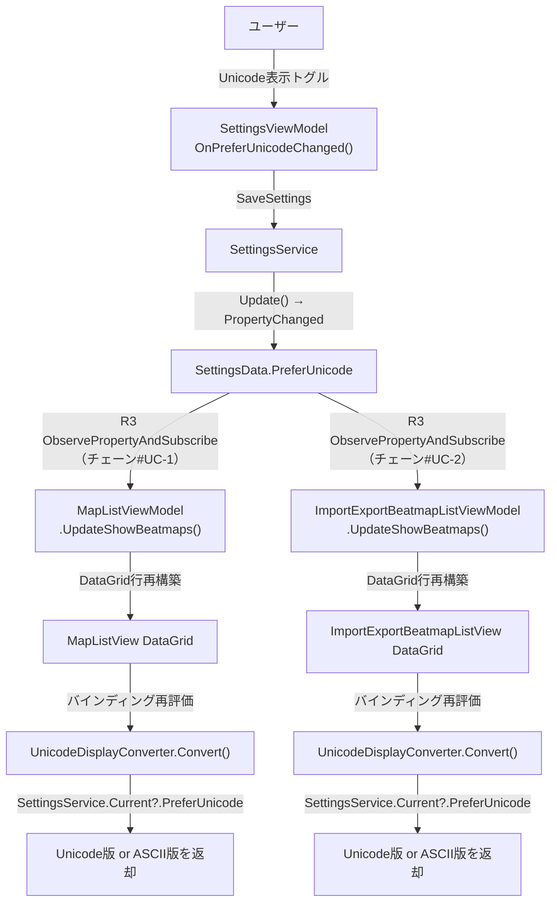

- `UnicodeDisplayConverter` は `SettingsService.Current`（internal static）から `PreferUnicode` を参照
- Unicode文字列が空の場合はASCII版にフォールバック
- フィルタ検索は `PreferUnicode` 設定に関係なく常にASCII版・Unicode版の両方をOR検索

### 6.4 テーマ変更時のチェーン

テーマ変更はR3リアクティブチェーンを使用せず、Avaloniaの組み込み機能で直接切り替える。

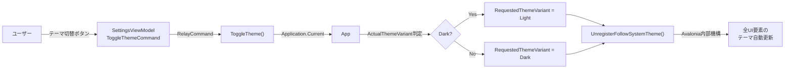

テーマ変更は `Application.RequestedThemeVariant` のセッターがAvalonia内部でUI全体のスタイル再評価をトリガーするため、明示的な通知チェーンは不要。`UnregisterFollowSystemTheme()` でシステムのテーマ追従を解除する。
---

## 7. ImportExportフロー

ImportExportページでは、コレクションをJSONファイルにエクスポート・インポートする。MapListモジュールと同様の親子View/ViewModel構成（**親仲介パターン**）を採用し、子VMが Subject で通知し親VMがオーケストレーションする。

### 7.1 エクスポートフロー

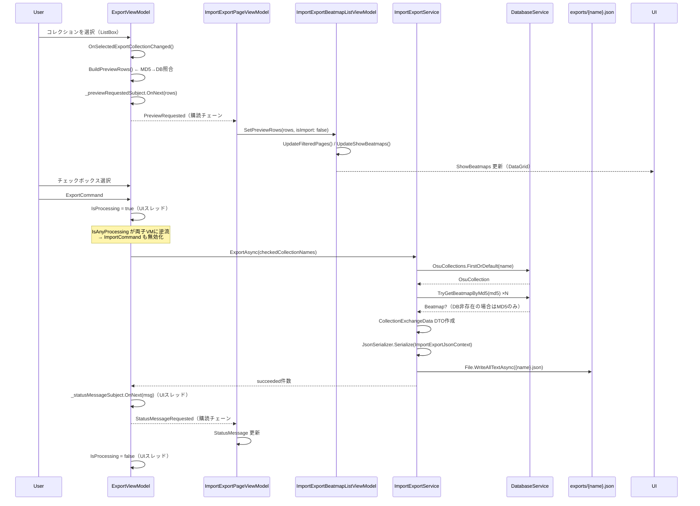

### 7.2 インポート選択→プレビュー表示フロー

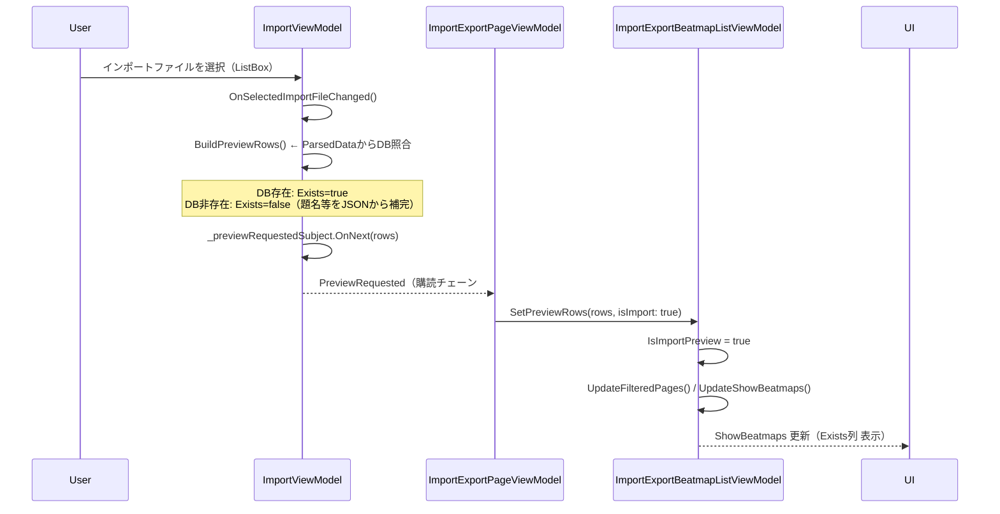

### 7.3 インポート実行→再初期化フロー

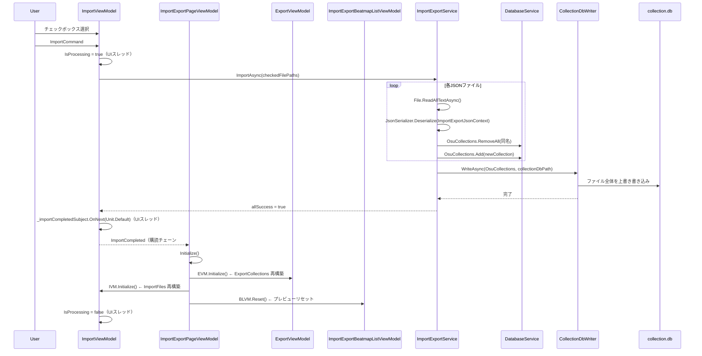

### 7.4 排他選択フロー

Export選択とImport選択は同時に存在できない。親VMがR3で監視し、片方が選択されたら逆側をnullクリアする。

```mermaid
flowchart TD
    EU["Export側を選択"] -->|SelectedExportCollection != null| C8["購読チェーン#IE-8"]
    C8 -->|"ImportViewModel.SelectedImportFile = null"| INC["Import選択クリア"]
    INC -->|OnSelectedImportFileChanged(null)| EAR["空配列をSubject発行"]
    EAR -->|SetPreviewRows([], isImport: true)| BLVM["BeatmapListVM プレビュークリア"]

    IU["Import側を選択"] -->|SelectedImportFile != null| C9["購読チェーン#IE-9"]
    C9 -->|"ExportViewModel.SelectedExportCollection = null"| ENC["Export選択クリア"]
    ENC -->|OnSelectedExportCollectionChanged(null)| EAR2["空配列をSubject発行"]
    EAR2 -->|SetPreviewRows([], isImport: false)| BLVM
```

### 7.5 フォルダ構造

| フォルダ | 用途 | 作成タイミング |
|---------|------|--------------|
| `{AppDirectory}/exports/` | エクスポートJSON出力先 | `ExportAsync()` 呼び出し時に自動作成 |
| `{AppDirectory}/imports/` | インポートJSON配置先 | `GetImportFiles()` 呼び出し時に自動作成 |